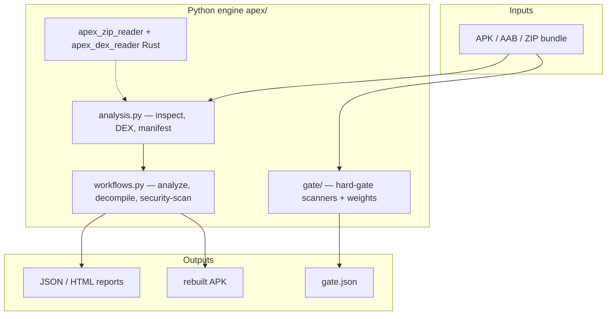

# APEX Blueprint Guide — How to Work With the App (v0.4.11)

Practical guide for **using**, **developing**, **shipping**, and **gating** APEX as it exists today.

---

## 1. What you have

APEX is three products sharing one Python engine (`apex/`):

| Surface | Entry | Best for |
|---------|--------|----------|
| **CLI** | `apex …` | Scripts, CI, automation |
| **Desktop web UI** | `apex gui` / `apex mobile` | Interactive RE on PC |
| **APEX Mobile** | `apex-mobile.apk` | On-phone analysis + optional PC remote |

**Version truth:** `apex/version.py` → currently **0.4.11**  
**Branch:** `cursor/complete-apex-app-5bc2` (active integration branch)  
**PR:** [#4](https://github.com/zowskyy/apex-android/pull/4)

---

## 2. Architecture (mental model)



**Layers:**

1. **Rust** (`core/zip_reader`, `core/dex_reader`) — fast ZIP + DEX; optional at runtime (fallbacks exist).
2. **Python core** — Androguard for AXML/ARSC/Java; bounded ZIP safety.
3. **Hard gate** — weighted static scanners; CI-blocking on FAIL.
4. **Wrappers** — Gradle/Chaquopy APK, desktop install scripts, platform launchers.

---

## 3. First-time setup (developer)

```bash
git clone https://github.com/zowskyy/apex-android
cd apex-android
python3.12 -m venv .venv
source .venv/bin/activate
pip install -U pip wheel maturin
pip install -e ".[dev,mcp]"
maturin develop --release -m core/zip_reader/Cargo.toml
maturin develop --release -m core/dex_reader/Cargo.toml

apex doctor          # tool availability
pytest -q            # full test suite
ruff check apex tests
```

**Optional tools** (reported by `apex doctor`, not required for core paths):

- `apktool` — resource/XML rebuild
- `apksigner` — signing
- Android SDK + Gradle 8.x — mobile APK build

---

## 4. Day-to-day workflows

### 4.1 Quick triage (any APK)

```bash
apex inspect app.apk
apex security-scan app.apk -o scan.json
apex gate app.apk --msv 28 --stage candidate -o gate.json
```

| Command | Purpose |
|---------|---------|
| `inspect` | Fast metadata, manifest, file inventory |
| `security-scan` | Archive safety, secrets, native, netsec, api_watch, CVE hints |
| `gate` | **Weighted score** + blocking FAILs for CI |

### 4.2 Deep reverse engineering

```bash
apex analyze app.apk --out report      # JSON + HTML
apex decompile app.apk --out source     # Java + smali
apex decode app.apk --out project       # editable project (raw or apktool)
apex build project --out rebuilt.apk
apex roundtrip app.apk --work rt        # decode → build → compare
apex diff old.apk new.apk
```

### 4.3 Web UI

```bash
apex gui                                # localhost:8765
apex mobile                             # LAN — phone browser as thin client
```

Accept the **disclaimer** on first launch (required for GUI/mobile/standalone).

### 4.4 CVE database (offline)

```bash
apex update-db                          # copies bundle → ~/.apex/cve_db.json
```

Curated DB: `apex/data/cve_db.json`. Dependency scanner is **advisory** (WARN only in gate).

---

## 5. Hard gate — how to think about it

**Run:**

```bash
apex gate sample.apk --msv 28 --stage candidate --ci
# exit 5 if gate_passed is false
```

**Stages** (minimum score): candidate 60 · rc 85 · beta 95 · production 100

**Scanners & weights** (sum = 1.0):

| Scanner | Weight | Blocks? |
|---------|--------|---------|
| manifest | 0.15 | FAIL on MSV / parse errors |
| dex | 0.10 | FAIL on structure issues |
| security | 0.15 | FAIL on archive traversal |
| secrets | 0.15 | FAIL on high-confidence secrets |
| native | 0.15 | FAIL on exec stack, 16K when minSdk≥35 |
| api_watch | 0.10 | WARN typical |
| netsec | 0.05 | WARN typical |
| lint | 0.05 | WARN (decompile + YAML rules) |
| dependency | 0.05 | **Never FAIL** (advisory) |
| obfuscation | 0.05 | WARN if mapping missing |

**Finding model:** each item has `confidence` (HIGH/MEDIUM/LOW) and `remediation`. LOW-confidence FAIL → WARN.

**Config:** `apex/gate/weights.toml`  
**Truth table:** `docs/SLICE_TRUTH.md`

**CI:** `.github/workflows/hard-gate.yml` + `scripts/hard_gate.sh`

---

## 6. APEX Mobile (on-device app)

### Build locally

```bash
export ANDROID_HOME="$HOME/Android/Sdk"
bash wrappers/android/build_standalone.sh
# → wrappers/android/dist/apex-mobile.apk
adb install -r wrappers/android/dist/apex-mobile.apk
```

**How it works:** `build_standalone.sh` symlinks `apex/` into Chaquopy `src/main/python`, runs `assembleRelease`, smoke-tests APK structure.

**App:** package `io.apex.standalone`, menu **Settings** (not “Server URL”).

### Phone usage

1. First launch: wait **2–3 minutes** (engine bootstrap).
2. Pick APK → analyze on device.
3. Optional PC boost: `apex mobile` on PC → phone **Settings → Desktop computer**.

**Troubleshooting:** `docs/BUILD_STANDALONE_APK.md`

---

## 7. Release & packaging

### Version sync (one command)

```bash
bash scripts/release/sync_version.sh 0.4.11
# Updates: pyproject.toml, apex/version.py, Gradle versionName/versionCode
```

### Android release bundle

```bash
bash wrappers/android/build_standalone.sh
cd wrappers/android/standalone && ./gradlew bundleRelease
bash scripts/package_android_release.sh 0.4.11
# → release-staging/android/APEX-Mobile-0.4.11.apk (+ .aab + zip)
```

### Desktop release bundle

```bash
# Local dev (builds Rust + wheel from source):
bash scripts/package_desktop_release.sh 0.4.11 linux

# CI mode (pre-built wheels in dist/):
CORE_WHEEL_DIR=dist bash scripts/package_desktop_release.sh 0.4.11 linux
```

Platforms: `linux` → `.tar.gz` · `macos` → `.zip` · `windows` → `.zip`

### GitHub Release (production)

**Tag push** `v0.4.11` triggers full DAG:

```
prepare → core-build (Linux/Win/macOS wheels)
       → android + desktop-linux + desktop-windows + desktop-macos
       → publish (GitHub Release)
```

**Dry-run:** Actions → **Release** → `workflow_dispatch` → version `0.4.11-test`

Details: `docs/CI_RELEASE_BLUEPRINT.md`

---

## 8. CI workflows map

| Workflow | When | What |
|----------|------|------|
| `ci.yml` | push/PR | ruff, pytest, gate on sample APK, cargo test |
| `pr-checks.yml` | push/PR | core wheels + import smoke + core pytest |
| `hard-gate.yml` | push/PR | `scripts/hard_gate.sh` (9-slice script) |
| `android-standalone.yml` | apex/ or standalone changes | `apex-mobile.apk` artifact |
| `release.yml` | tag `v*` or manual | full multi-platform release |

---

## 9. Key files cheat sheet

| Need to… | Open |
|----------|------|
| Change gate weights | `apex/gate/weights.toml` |
| Add lint rule | `apex/lint_rules.yaml` |
| Add CVE library | `apex/data/cve_db.json` |
| Add API watch pattern | `apex/gate/scanners/watchlists/` |
| Change mobile deps | `wrappers/android/standalone/app/build.gradle` |
| Release scripts | `scripts/package_*_release.sh`, `scripts/release/sync_version.sh` |
| Capability status | `docs/SLICE_TRUTH.md`, `docs/COMPLETION_ROADMAP.md` |

---

## 10. Security & scope boundaries

- **Static only** — no dynamic execution of APK code in engine.
- **Not a malware verdict** — findings are evidence for human review.
- **Web UI** — loopback by default; `apex mobile` binds LAN (same Wi‑Fi).
- **Path containment** — `apex/web_security.py` keeps workspace bounded.
- **Out of scope:** iOS Mach-O, live CVE API, MobSF dynamic analysis parity.

Acceptable use: `docs/ACCEPTABLE_USE.md`

---

## 11. What’s next (post–v0.4.11)

From `docs/COMPLETION_ROADMAP.md`:

- DEX xref at scale via native `dex_reader`
- Expanded CVE DB + optional online refresh
- Gate stage promotion matrix in CI
- Optional Pydantic schema for `gate.json`
- Production Android signing (replace debug signing in Gradle)

---

## 12. Quick decision tree

```
Need to analyze an APK?
├─ One-off on PC        → apex gui  or  apex analyze
├─ On phone             → APEX Mobile APK
├─ CI pass/fail         → apex gate --ci
├─ Security report      → apex security-scan
├─ Ship a release       → tag vX.Y.Z  or  Release workflow
├─ Build phone APK      → wrappers/android/build_standalone.sh
└─ Change gate policy   → weights.toml + scanner in apex/gate/scanners/
```

---

## Related docs

| Doc | Topic |
|-----|--------|
| [README.md](../README.md) | Install, CLI overview, editions |
| [COMPLETION_ROADMAP.md](COMPLETION_ROADMAP.md) | Slice capability matrix |
| [SLICE_TRUTH.md](SLICE_TRUTH.md) | Repo-grounded implementation status |
| [CI_RELEASE_BLUEPRINT.md](CI_RELEASE_BLUEPRINT.md) | Release DAG + artifacts |
| [BUILD_STANDALONE_APK.md](BUILD_STANDALONE_APK.md) | Mobile build + troubleshooting |
| [HARD_GATE_SLICES.md](HARD_GATE_SLICES.md) | Original 9-slice gate design |
| [PROJECT_BLUEPRINT.md](PROJECT_BLUEPRINT.md) | Long-term jadx/apktool vision |
