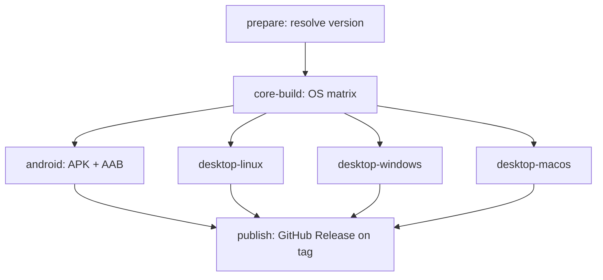

# CI / Release Blueprint (audited)

Production release DAG implemented in `.github/workflows/release.yml`.

## DAG



## Audit corrections vs generic blueprint

| Topic | Generic blueprint | This repo |
|-------|-------------------|-----------|
| Core wheel | Single `maturin build` at root | **Three wheels**: `apex_zip_reader`, `apex_dex_reader`, `apex-android` (setuptools) |
| Android Gradle | Kotlin DSL + `core-wheel.whl` pip inject | **Groovy** `build.gradle` + Chaquopy pip list + **symlink** `apex` via `build_standalone.sh` |
| Android namespace | `com.apex.mobile` | **`io.apex.standalone`** (unchanged) |
| Version sync | Gradle only | `scripts/release/sync_version.sh` → pyproject, `apex/version.py`, Gradle |
| Desktop CI | `CORE_WHEEL=dist/*.whl` | **`CORE_WHEEL_DIR=dist`** copies all platform wheels |
| Default branch | `main` | **`master`** (+ `main` in PR checks) |

## Artifacts

| Job | Artifact name | Contents |
|-----|---------------|----------|
| core-build | `core-wheels-{Linux\|Windows\|macOS}` | `dist/*.whl` |
| android | `android-release` | `APEX-Mobile-*.{apk,aab,zip}` |
| desktop-linux | `desktop-linux` | `APEX-*-linux-x64.tar.gz` |
| desktop-windows | `desktop-windows` | `APEX-*-windows-x64.zip` |
| desktop-macos | `desktop-macos` | `APEX-*-macos.zip` |

## Manual dry-run

```bash
# GitHub → Actions → Release → Run workflow → version 0.4.11-test
```

## Local parity

```bash
bash wrappers/android/build_standalone.sh
bash scripts/package_android_release.sh 0.4.11
bash scripts/package_desktop_release.sh 0.4.11 linux   # builds wheels from source
CORE_WHEEL_DIR=dist bash scripts/package_desktop_release.sh 0.4.11 linux  # CI mode
```
