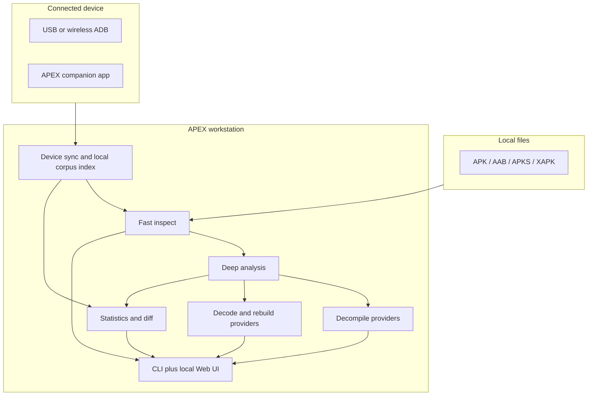

# COMPETITIVE_STRATEGY.md — Beat APK Analyzer and stay ahead of current RE tooling

Date: 2026-08-02  
Status: second-pass audited against current Android/tooling practice and APEX codebase utilization  
Scope: APEX v0.3+ product strategy, not current v0.2 capabilities

---

## Executive verdict

The prior strategy is directionally right but **technically overbroad**. APEX should **not** try to become a phone-first clone of Martin Styk's [APK Analyzer](https://play.google.com/store/apps/details?id=sk.styk.martin.apkanalyzer). It should become the **fastest local analysis workstation** that also offers **device-aware workflows** through ADB, wireless debugging, and a companion app.

**Second-pass confirmation (2026-08-02):** after re-checking OWASP MASTG decompile guidance, Apktool 3.0.0 release notes, Play `QUERY_ALL_PACKAGES` policy, Android SDK `apkanalyzer` docs, and comparable wrappers (APKLab, RevEng-IDE, JADX-NO-MCP, PulseAPK), plus the live APEX stack in this repo, the revised strategy still holds. The main remaining problem is **doc/code drift**: `PROJECT_BLUEPRINT.md` still reads like a native jadx/apktool replacement program, while the shipped v0.2 code and this strategy correctly treat those tools as preferred providers.

### What survives the audit

- Desktop APEX as the **brain**
- Companion Android app as optional **eyes/hands**
- Fast/deep split for analysis
- Incremental device index
- No telemetry / local-first privacy posture
- Beating APK Analyzer with manifest → DEX → Java → security linkage

### What changes after the audit

1. **“Installed-app scanning” must not imply Play-Store-style broad visibility as a given.**  
   Android 11+ package visibility is restricted, and Google Play policy makes `QUERY_ALL_PACKAGES` a sensitive permission with a limited allowed purpose. APEX should support:
   - explicit APK/AAB scanning for all users
   - connected-device scanning via ADB for the **user’s own device**
   - a companion app that uses the **narrowest feasible visibility model** and asks for broad access only if product-market fit truly requires it

2. **“Match APK Analyzer in every area” is the wrong framing.**  
   The correct target is:
   - **Parity** for report completeness on metadata, permissions, components, cert display, icon export, statistics
   - **Superiority** on speed, automation, privacy, rebuild, decompile, diff, and security analysis
   - **Honest unsupported states** where platform policy or device state prevents a feature

3. **Androguard should remain the metadata/DEX backbone, but jadx should be the preferred Java engine for best output quality.**  
   Current empirical literature and 2026 tooling reviews still rank jadx ahead of Androguard for Java-source recovery. APEX v0.2 used Androguard for Java because it was integrated and available. That is acceptable for the first release, but not the best long-term competitive answer.

4. **Apktool 3.x changes the rebuild assumptions.**  
   Apktool 3.0+ is aapt2-only and more modern. APEX should continue to wrap apktool for compiled-resource rebuilds rather than pretending the raw backend can do everything. The raw backend remains valuable for lossless archival round-trips.

5. **The official Android CLI tool `apkanalyzer` is a different product from the Play Store APK Analyzer app.**  
   We should benchmark against both:
   - Martin Styk APK Analyzer (consumer app on Play)
   - Android SDK `apkanalyzer` (developer CLI)
   - Android Studio APK Analyzer GUI
   - jadx / apktool / bundletool / apksigner for specialist parity

---

## Latest-tooling audit summary

### Android platform and developer guidance

| Topic | Current guidance / impact on APEX |
|---|---|
| Package visibility | Android 11+ restricts installed-app visibility. `QUERY_ALL_PACKAGES` is not a casual permission. Prefer `<queries>`, targeted lookup, or ADB-based device workflows for the user’s own device. |
| Wireless debugging | Android 11+ supports wireless debugging with pairing. Android 17/adb 37 adds “adb Wi-Fi 2.0” convenience, but trusted-network and pairing flows remain the core model. APEX should support USB + wireless pairing UX, not assume permanent background access. |
| Installed app metadata | For a user-owned connected device, ADB (`pm`, `dumpsys package`, `cmd package`) is the right bridge. It avoids Play Store visibility policy issues for the desktop app. |
| App Bundle handling | `bundletool` remains the right wrapper for `.aab` → `.apks`, connected-device targeting, and manifest/resource dumps. |
| Signing verification | `apksigner verify --print-certs` remains the authoritative baseline. APEX can build a fast native signing parser, but should preserve apksigner as the correctness oracle. |

### Comparable projects and what they prove

| Project | What it proves | Implication for APEX |
|---|---|---|
| Martin Styk APK Analyzer | Excellent consumer UX for installed-app metadata, permission descriptions, certificate presentation, stats, and save/share. | APEX must match the **report completeness** and speed, not necessarily the same phone-only shape. |
| Android SDK `apkanalyzer` | Strong official CLI for manifest permissions, DEX references, resources, APK compare. | APEX should implement those core outputs and benchmark against them. |
| Android Studio APK Analyzer | Best-in-class GUI composition, DEX view, manifest reconstruction, and comparison UX. | APEX should not try to out-GUI Studio first; it should out-automate and out-integrate it. |
| jadx 1.5.x | Best-quality Java decompiler, actively improving, better call graph support, better Kotlin metadata handling. | APEX should wrap or integrate jadx as the preferred decompile backend. |
| apktool 3.x | aapt2-only rebuild path, better internals, automatic API detection. | APEX should keep apktool as the compiled-resource rebuild provider. |
| Androguard | Excellent Python-native parsing, static analysis, and programmatic access. | Keep it for metadata, DEX indexing, and fallback decompile; not the sole Java engine. |
| browser-only APK analyzers | Strong privacy posture and zero-upload story. | APEX should emphasize local-only analysis and possibly later add browser/WASM surfaces. |
| droidsaw / similar Rust-native suites | Rust-native, offline, taint-analysis-forward, agent-friendly. | APEX’s long-term differentiation should include native hot paths + agent-friendly JSON/SARIF surfaces. |
| APKLab (VS Code) | Mature wrapper pattern: apktool + jadx + uber-apk-signer + configurable tool paths + Apktool 3.0 CLI awareness. | APEX should copy the **provider orchestration** model, not invent a parallel IDE plugin. |
| RevEng-IDE / similar desktop suites | One-click decode+decompile pipeline with auto-downloaded tool jars, ADB install, Frida adjacent. | Tool bootstrap + version pinning belong in `apex doctor` / first-run setup. |
| JADX-NO-MCP / AI-oriented wrappers | Early packer detection before expensive decompile; AI-friendly Markdown/JSON exports; call-graph export. | Add cheap preflight heuristics before jadx; keep agent-friendly report surfaces. |
| PulseAPK | Frontend over apktool + signer with Smali-focused security regex scans. | Confirms rebuild/sign remain wrapper work; APEX’s edge is deeper DEX/Java + automation. |

---

## Second-pass audit — codebase vs modern methods

This pass checked what APEX **actually ships and uses**, not only what the strategy claims.

### Live stack observed in this checkout (v0.2)

| Component | Present | Used on product path? | Audit note |
|---|---|---|---|
| Androguard 4.1.4 | Yes | Yes — AXML/ARSC/DEX/Java (`DecompilerDAD`), verify cert counts | Correct metadata backbone; **incorrect sole long-term Java engine** |
| Rust `apex_zip_reader` | Yes (installed) | Yes — preferred extract with Python fallback | Keep; security-differentiated |
| Rust `apex_dex_parser` | Yes (rlib) | No — not PyO3-bridged into CLI/UI | Keep as validation/evolution layer; do not block product slices on bridging |
| jinja2 | Yes | Yes — HTML report template only | Fine; not a competitive dependency |
| networkx | Declared in `setup.py` | **No imports anywhere** | Drop or defer until call-graph work needs it |
| apkInspector / asn1crypto / cryptography | Transitive via Androguard | Not used directly by APEX | Do not treat as APEX capabilities |
| apktool / apksigner / adb / aapt2 | Optional PATH/env | Detected by `doctor`, mostly null in this env | Strategy depends on them; doctor should also report jadx, bundletool, apkanalyzer |
| jadx | Not integrated | No | Highest-priority missing provider |
| bundletool / apkanalyzer | Not integrated | No | Needed for AAB + official oracle benchmarks |

### What modern comparable projects do that APEX should copy

1. **Wrap first, unify second.** APKLab / RevEng-IDE / JADX-NO-MCP all treat jadx + apktool (+ signer) as the engines and compete on orchestration, UX, automation, and reports. APEX’s blueprint “replace jadx/apktool” language is aspirational R&D, **not** the competitive path.
2. **CLI subprocess providers before JVM embedding.** jadx-as-library is a Java API. From Python, the credible v0.3 approach is version-pinned `jadx` / `jadx-cli` subprocess with `--single-class` for on-demand UI, plus timeout and provenance. Library embedding can wait.
3. **Separate oracles by domain.**  
   - `apkanalyzer` → manifest permissions, DEX refs, resources, APK compare/size  
   - `apksigner verify --print-certs` → signing schemes, cert fingerprints, warnings  
   - Do not expect `apkanalyzer` to replace signing UX.
4. **Cheap preflight before decompile.** Packer/protector heuristics (zip/DEX shape) before invoking jadx avoids wasted minutes — already common in AI-oriented wrappers.
5. **Tool bootstrap.** Successful wrappers auto-download or clearly guide apktool/jadx/signer jars. `apex doctor` should diagnose *and* point to install/bootstrap, not only print `null`.

### Blueprint contradictions that this audit resolves

| Blueprint claim | Audited correction |
|---|---|
| “Replaces apktool + jadx workflow” | **Orchestrates and exceeds them**; does not displace their engines on day one |
| “AAB without bundletool dependency” (slice 3.7) | **Wrap bundletool first**; native AAB only if a proven hot-path gap appears |
| “Wrap jadx-core, replace incrementally” as Key Decision | **Wrap jadx as preferred Java provider**; native decompiler remains research, not the beat criterion |
| Raw 10x decompile/memory targets as near-term proof | Keep as stretch research goals; competitive beat criteria are provenance, quality, automation, device sync, privacy |

### Signing path gap (code-specific)

`verify_apk()` today uses Androguard `APK.get_certificates()` for scheme booleans and certificate counts. That is fine for a presence check. Competitive cert UX still requires **`apksigner verify --print-certs`** (and optionally `--print-certs-pem`) as the correctness path, with Androguard/native parsers as faster secondary views.

### Permission / device gap (policy reconfirmed)

Play still treats installed-app inventory as sensitive and restricts `QUERY_ALL_PACKAGES` to narrow core-purpose cases (device search, antivirus/security, file managers, browsers, etc.). Even if a companion later qualifies as a security app, **desktop ADB sync for the user’s own device remains the primary path** and avoids Play distribution risk for the workstation product.

---

## Revised product positioning

### APEX should win as

**“The fastest local Android app intelligence workstation: APK/AAB inspection, device sync, decompile, security scan, rebuild, verify, and diff — with no cloud dependency.”**

### APEX should not claim to be

- a drop-in replacement for Android Studio APK Analyzer GUI on day one
- a Play Store phone app that freely scans all installed apps without policy constraints
- a full substitute for apktool 3.x when compiled-resource rebuild is required
- a replacement for jadx’s best-quality Java output without proof

---

## Competitive matrix — revised

| Area | APK Analyzer (Play app) | Android SDK `apkanalyzer` | APEX today | APEX target after strategy |
|---|---|---|---|---|
| Package/version/SDK/manifest | Strong | Strong | Strong | Strong |
| Installed device app browsing | Strong, phone-native | Not applicable | Missing | Supported via ADB/companion with policy-aware limitations |
| Permission names + descriptions | Strong | Basic names only | Names only | Descriptions, protection levels, granted state, code linkage |
| Certificate display | Strong consumer UI | `apksigner` strong CLI | Basic signature booleans/counts | Full chain, schemes, lineage, fingerprints, rotation warnings |
| Save APK / icon | Strong | Not applicable | Missing | APK/splits/icon/report/project export |
| Statistics | Strong | Not applicable | Missing | Device/corpus stats with security/DEX dimensions |
| DEX class/method browsing | Limited | Strong CLI | Strong | Strong + call graph + decompile |
| Java decompile | No | Limited/smali focus | Yes, Androguard backend | Yes, jadx-preferred backend + fallback |
| Rebuild | No | Not primary purpose | Raw/apktool backend | Same, with better orchestration |
| Round-trip verify | No | Limited compare | Yes | Stronger + corpus benchmarks |
| Security scan | Limited | No | Yes | Stronger MASVS/SARIF/agent-friendly output |
| Privacy | App is open source, but privacy policy allows backend metadata collection in some flows | Local SDK tool | Local-only | Explicit no-telemetry by default |

---

## What APEX should build natively vs wrap — revised

| Capability | Best implementation choice now | Why |
|---|---|---|
| ZIP traversal/security | Native Rust `apex_zip_reader` | Already strong, proven, and security-differentiated |
| Fast ZIP inventory | Native Rust | Needed for <100 ms inspect and device sync |
| Manifest/AXML decode | Androguard now, native Rust later | Fast delivery now, hot-path replacement later |
| `resources.arsc` summary | Androguard now, native Rust later | Same reasoning |
| DEX structural parsing | Androguard + existing Rust parser as evolving validation layer | Better coverage today, native evolution later |
| DEX xref / call graph | Androguard now; later compare with jadx call graph module | jadx is moving strongly here too |
| Java decompile | **jadx preferred**, Androguard fallback | Best output quality |
| Smali disassembly | apktool/baksmali wrappers | Round-trip correctness |
| Compiled-resource decode/rebuild | apktool 3.x wrapper | aapt2 integration is the right provider |
| AAB operations | bundletool wrapper | Official tool for `.aab` handling |
| Signing verification | apksigner wrapper now; native signing-block parser later | apksigner is the correctness oracle |
| Permission catalog | Static bundled AOSP metadata | Simple and deterministic |
| Granted permissions | ADB / Shizuku / companion context | Not available from APK bytes alone |
| Device sync | ADB first; companion app later | Avoids Play policy complexity for desktop power users |
| Companion app | Kotlin Android app, minimal engine, local pairing | Product polish, not core compute |

---

## Revised architecture

---

## Revised roadmap

### Phase 1 — Benchmark parity and provider hardening

**Goal:** make APEX’s core outputs credible against the best current tools.

| Slice | Deliverable | Benchmark target |
|---|---|---|
| 1.1 | Add provider abstraction with explicit backend provenance in every report | Every report says `provider=androguard|jadx|apktool|apksigner|apkanalyzer|bundletool|rust` plus tool version when known |
| 1.2 | Add `apksigner verify --print-certs` provider path; keep Androguard cert counts as fallback | cert output parity with official SDK |
| 1.3 | Add `apkanalyzer` benchmark adapter for permissions, DEX references, resources, compare | side-by-side comparison against official CLI (not used as signing oracle) |
| 1.4 | Add jadx CLI provider (`--single-class` for on-demand) with version pin, timeout, Androguard fallback | jadx output quality ≥ Androguard on fixture corpus |
| 1.5 | Add apktool 3.x provider detection (aapt2-only assumptions) and framework diagnostics | correct modern rebuild behavior; refuse silent aapt1 assumptions |
| 1.6 | Expand `apex doctor` for jadx/bundletool/apkanalyzer + install hints / optional jar bootstrap | missing tools are actionable, not silent `null` |
| 1.7 | Optional cheap packer/protector preflight before full decompile | fail-fast on known packer shapes |

### Phase 2 — Device-aware local corpus

**Goal:** beat APK Analyzer on desktop speed/automation for a user-owned device.

| Slice | Deliverable | Beat criterion |
|---|---|---|
| 2.1 | `apex device list` via ADB | enumerate device packages fast |
| 2.2 | `apex device pull <pkg>` | pull base/split APKs with deterministic layout |
| 2.3 | `apex device sync` | incremental local corpus index keyed by package/version/hash |
| 2.4 | `apex device stats` | index-only stats, faster than rescanning |
| 2.5 | Web UI Devices tab | one-click local device app → full analysis |

### Phase 3 — Permission, cert, component superiority

| Slice | Deliverable | Beat criterion |
|---|---|---|
| 3.1 | Bundled AOSP permission catalog | names, descriptions, protectionLevel, flags |
| 3.2 | Granted-state enrichment via `dumpsys package` / companion | declared vs granted |
| 3.3 | Permission-to-code linkage | show sensitive API usage in classes/methods |
| 3.4 | Full signing UX | schemes, cert chain, fingerprints, validity, rotation |
| 3.5 | Component launch | ADB `am start` with exported-component safety checks |

### Phase 4 — Exports, icons, and corpus dashboards

| Slice | Deliverable | Beat criterion |
|---|---|---|
| 4.1 | `apex icon` export | icon parity |
| 4.2 | `apex export` bundle | APK + manifest + report + optional source tree |
| 4.3 | Corpus dashboards | SDK/permission/cert/native/DEX distributions |
| 4.4 | Corpus diff | what changed since last sync |

### Phase 5 — Companion app and polish

| Slice | Deliverable | Beat criterion |
|---|---|---|
| 5.1 | Minimal Kotlin companion app | phone browsing of allowed app inventory |
| 5.2 | Local pairing with desktop | no cloud, no telemetry |
| 5.3 | Open-source release path (GitHub + F-Droid) | adoption/trust |

---

## Privacy and policy risk register

| Risk | Why it matters | Mitigation |
|---|---|---|
| `QUERY_ALL_PACKAGES` policy risk | Play distribution can reject or restrict broad visibility | Companion app should use targeted `<queries>` when possible; desktop device workflows should prefer ADB |
| ADB trust/security risk | Wireless debugging expands attack surface on trusted networks | Explicit pairing UX, trusted-network messaging, no silent persistence |
| Decompiler/rebuild tool drift | jadx/apktool/bundletool behavior changes over time | Provider abstraction, version pinning, fallback paths, `apex doctor --json` |
| Signing correctness risk | Parsing signing block incorrectly can produce dangerous conclusions | Keep `apksigner` as oracle; native parser only after conformance corpus |
| Security-scan false positives | Static scanning can overclaim | Evidence-first findings, SARIF/CWE mapping, disclaimer states |
| Privacy overreach | Installed-app inventory is sensitive data | Local-only by default, no telemetry, explicit user consent before any device sync |

---

## Success metrics — revised

### Parity metrics

- **Report completeness:** 100% of fields shown by APK Analyzer’s core report are either present or explicitly marked unavailable with reason.
- **Permission UX:** permission names + descriptions + protection levels + granted state where available.
- **Cert UX:** fingerprint, scheme, validity, lineage, warnings.
- **Export UX:** APK/splits/icon/report/project export.

### Superiority metrics

- **Single APK inspect:** &lt;100 ms on local files.
- **Device sync:** incremental rescan faster than full rescan; index-only stats &lt;500 ms.
- **Java decompile quality:** jadx backend preferred unless proven otherwise on fixture corpus.
- **Automation:** every workflow emits stable JSON; selected workflows emit SARIF.
- **Privacy:** no network calls required for core analysis; no telemetry by default.

---

## Concrete first engineering slices

1. **Provider abstraction + provenance + doctor expansion** (jadx / apktool 3.x / apksigner / apkanalyzer / bundletool)
2. **`apex device sync` and SQLite-backed local corpus index**
3. **Permission catalog + granted-state enrichment**
4. **Signing UX upgrade via apksigner oracle**
5. **Web UI Devices tab + corpus stats**

Housekeeping that should ride with slice 1.1: remove unused `networkx` until a call-graph feature imports it; align blueprint language with this document so “replace jadx/apktool” is not misread as the near-term plan.

Implementation contracts and acceptance criteria are defined in
[`IMPLEMENTATION_GUIDE.md`](IMPLEMENTATION_GUIDE.md). The authoritative slice
order and release gates are in [`ROADMAP.md`](ROADMAP.md).

---

## Final strategic judgment

APEX should **not** fight APK Analyzer by becoming another phone-only metadata browser. It should beat it by being:

- faster on workstation-class analysis
- deeper in DEX/Java/security/rebuild workflows
- more privacy-preserving
- more automation-friendly
- still device-aware for the user’s own phone

**Second-pass bottom line:** the winning architecture is the same one successful 2025–2026 RE workstations already use — **orchestrate best-of-breed providers with provenance**, keep native code for proven hot paths (ZIP security, later parsers), and use ADB for device truth. Replacing jadx/apktool/apksigner/bundletool natively is research debt, not the competitive strategy.
