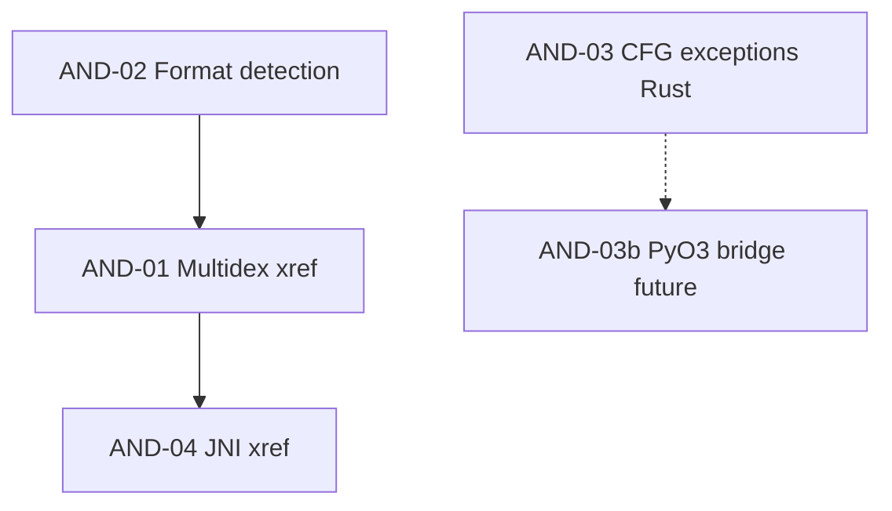

# Technical Design — Analysis-depth slices AND-01 through AND-04

Date: 2026-08-02  
Status: design only (no implementation in this document)  
Requirements source: [`PROJECT_BLUEPRINT.md`](PROJECT_BLUEPRINT.md) Phase 5  
Governing rules: [`PRINCIPLES.md`](PRINCIPLES.md), [`AGENTS.md`](../AGENTS.md)

This document is the implementation contract for four analysis-depth slices. Each slice is complete only when every numbered verification step in the blueprint passes.

---

## Cross-cutting conventions

### Report schema

All slices keep `schema_version: 3`. New capability is **additive** — existing top-level keys (`meta`, `security`, `resources`, `native`, `dex`, `crossrefs`, `reachability`, `provenance`, …) remain present with unchanged semantics for fields that already exist. New fields are optional for backward-compatible consumers; tests that assert `schema_version == 3` continue to pass unchanged.

### Provenance

Every new analysis engine records a `ProvenanceRecord` via `ProvenanceCollector` in `apex/providers/types.py`, attached by `attach_provenance()` in the same module. Pattern matches `analyze_apk()` in `apex/workflows.py` (lines 168–268).

### Layer parity

Per PRINCIPLES §3 and §7, each slice wires:

| Layer | Location |
|---|---|
| Domain logic | `apex/analysis.py` and/or new `apex/<module>/` |
| Workflows | `apex/workflows.py` |
| Services | `apex/services.py` |
| CLI | `apex/cli.py` |
| Web UI | `apex/web.py` |
| Tests | `tests/test_and0N_*.py` (+ Rust tests under `core/`) |

---

## AND-01 — Unified multidex symbol and cross-reference space

### 1. Problem restatement

**Verified root cause in APEX:**

- `load_dex()` (`apex/analysis.py:336–344`) constructs one Androguard `Analysis(dex)` per buffer and calls `create_xref()` in isolation.
- `dex_metadata()` (`apex/analysis.py:346–405`) emits per-DEX `edges` from that single-DEX analysis; cross-DEX callees are absent from the callee DEX's symbol space, so xref resolution fails or produces dangling targets.
- `scan_dex_metadata()` (`apex/analysis.py:408–429`) concatenates per-DEX `classes`, `methods`, `strings`, and `edges` without deduplication or cross-DEX resolution.
- `build_crossrefs()` (`apex/analysis.py:432–451`) synthesizes graph nodes from unresolved edge **strings** (`nodes.setdefault(target, …)`), masking unresolved calls as if they were real methods.

**Ghidra mapping:** APEX has no address space. The transferable requirement is a **unified symbol table and xref table spanning all DEX files**, with owning DEX recorded on both endpoints.

### 2. Proposed design

#### New module: `apex/dex/unified_index.py`

```python
from __future__ import annotations

from dataclasses import dataclass, field
from pathlib import Path
from typing import Any, Literal

@dataclass(frozen=True)
class MethodSymbol:
    """Canonical method identity across multidex."""
    dex: str                          # e.g. "classes2.dex"
    class_name: str                   # dotted Java name
    name: str
    descriptor: str                   # Dalvik proto, e.g. "(Landroid/os/Bundle;)V"
    access: str
    has_code: bool

    @property
    def symbol_id(self) -> str:
        return f"{self.class_name}::{self.name}{self.descriptor}"

@dataclass(frozen=True)
class ClassSymbol:
    dex: str
    name: str                         # dotted Java
    descriptor: str                   # Lcom/foo/Bar;
    super: str
    interfaces: tuple[str, ...]
    access: str

@dataclass
class XrefEdge:
    caller: MethodSymbol
    callee: MethodSymbol | None       # None when unresolved
    callee_id: str                    # raw target id string
    offset: int
    resolved: bool
    resolution: Literal["exact", "synthetic_stub"] = "exact"

@dataclass
class UnifiedDexIndex:
  dex_files: list[str]
  classes: list[ClassSymbol]
  methods: list[MethodSymbol]
  edges: list[XrefEdge]
  symbol_table: dict[str, MethodSymbol]   # symbol_id -> defining symbol
  class_index: dict[str, ClassSymbol]     # dotted class name -> symbol (see dup policy)
  stats: dict[str, Any] = field(default_factory=dict)
  errors: list[dict[str, str]] = field(default_factory=list)
  provenance: dict[str, str] = field(default_factory=dict)


def load_multidex_analysis(
    dex_by_name: dict[str, bytes],
    *,
    with_decompiler: bool = False,
) -> tuple[Any, Any]:
    """Return (primary_dex, unified Analysis) with every DEX registered.

    Uses Androguard's multi-DEX API: one Analysis, ``analysis.add(dex_i)`` for
  each file, single ``create_xref()`` after all DEX are loaded.
    Raises ApexError when androguard is unavailable.
    """


def build_symbol_table(
    dex_by_name: dict[str, bytes],
    analysis: Any,
) -> UnifiedDexIndex:
    """Populate UnifiedDexIndex from a multi-DEX Androguard Analysis."""


def scan_dex_metadata_unified(extract_dir: Path) -> dict[str, Any]:
    """Drop-in replacement for scan_dex_metadata() producing merged index."""


def unified_index_to_report_dict(index: UnifiedDexIndex) -> dict[str, Any]:
    """Serialize UnifiedDexIndex to the ``dex`` report section shape."""
```

#### Changes to `apex/analysis.py`

| Function | Change |
|---|---|
| `load_dex` | Keep for single-DEX callers; delegate multidex to `load_multidex_analysis` |
| `scan_dex_metadata` | Call `scan_dex_metadata_unified`; thin wrapper preserves function name for imports |
| `build_crossrefs` | Accept optional `symbol_table`; never synthesize method nodes for unresolved `callee_id`; emit `resolved: false` edges |
| `build_reachability` | Use resolved edges only; add `cross_dex_edge_count` stat |

#### `build_crossrefs` signature change

```python
def build_crossrefs(dex_index: dict[str, Any]) -> dict[str, Any]:
    # dex_index may include:
    #   "symbol_table": {symbol_id: {dex, class, name, descriptor, ...}}
    #   "edges": [{caller_*, callee_*, resolved, caller_dex, callee_dex, offset}]
```

New node shape for methods:

```python
{"id": "com.foo.Bar::baz()V", "kind": "method", "dex": "classes.dex", "resolved": True}
```

New edge kinds unchanged (`contains`, `calls`); add optional fields `caller_dex`, `callee_dex`, `resolved`.

### 3. Data / schema changes

Add under `report["dex"]` (additive):

```json
{
  "dex_files": ["classes.dex", "classes2.dex", "classes3.dex"],
  "classes": [{"dex": "...", "name": "...", "descriptor": "...", "duplicate_policy": null}],
  "methods": [{"dex": "...", "class": "...", "name": "...", "descriptor": "...", "symbol_id": "..."}],
  "edges": [{
    "caller_class": "...", "caller_method": "...", "caller_dex": "classes2.dex",
    "callee": "com.example.Target::run()V", "callee_dex": "classes.dex",
    "offset": 42, "resolved": true
  }],
  "symbol_stats": {
    "class_count_unique": 1200,
    "method_count_unique": 8500,
    "cross_dex_edge_count": 37,
    "duplicate_class_conflicts": []
  }
}
```

Add under `report["reachability"]`:

```json
{"cross_dex_edge_count": 37}
```

Add under `report["crossrefs"]` edge objects: `resolved`, `caller_dex`, `callee_dex` (optional; absent treated as legacy single-dex).

**Backward compatibility:** Existing fields (`classes[].dex`, `edges[].caller_class`, etc.) remain. Consumers ignoring new keys behave as today. `schema_version` stays `3`.

### 4. Wiring plan

| Touchpoint | Change |
|---|---|
| **Python API** | `scan_dex_metadata(extract_dir)` transparently returns unified index; export `build_symbol_table`, `UnifiedDexIndex` from `apex/dex/unified_index.py` and re-export in `apex/__init__.py` if public |
| **Workflows** | `analyze_apk()` (`workflows.py:187–190`) — no call-site change; provenance adds `operation="dex.xref", provider="androguard-multidex"` |
| **CLI** | `apex analyze` — no new flags; summary line adds cross-dex count: `Cross-DEX calls: N` |
| **CLI inspect** | N/A (fast inspect does not run full xref today) |
| **Web UI** | `apex/web.py` `_analyze_path` (lines 177–189) currently calls `dex_metadata` per file — switch to `scan_dex_metadata_unified` on extracted dir or inline multidex load; add Cross-refs panel row for `cross_dex_edge_count` |
| **Services** | `AnalysisService.inspect_bundle` already calls `analyze_any` → `analyze_apk`; no API change |
| **SARIF** | Not applicable for xref graph (security SARIF unchanged) |
| **HTML report** | `REPORT_TEMPLATE` in `workflows.py` — add DEX cross-ref stat card |

### 5. Algorithms and edge cases

#### Cross-DEX symbol table construction

1. **Load order:** Sort `classes*.dex` lexicographically (`classes.dex`, `classes2.dex`, …) — matches `scan_dex_metadata` today.
2. **Androguard unified analysis:**
   ```python
   analysis = Analysis(dex_files[0])
   for raw, name in remaining:
       analysis.add(DEX(raw))
   analysis.create_xref()  # once, after all DEX loaded
   ```
3. **Symbol key:** `symbol_id = f"{class_name}::{method_name}{descriptor}"` where `class_name` comes from `descriptor_to_java()`.
4. **Class index:** Keyed by dotted `class_name`. **Duplicate class definitions** (same descriptor in multiple DEX — invalid but seen in repacked malware):
   - **Policy:** first DEX in sort order wins for `class_index`; record conflict in `duplicate_class_conflicts: [{name, dexes: [...]}]`.
   - Methods remain distinct per owning DEX even when class names collide (method `symbol_id` includes descriptor; add `dex` field on collision).
5. **Edge resolution:** For each `method_analysis.get_xref_to()`:
   - Resolve callee via unified `analysis.get_method(class_name, method_name, descriptor)` or `analysis.get_method_analysis(...)`.
   - If callee class exists in another DEX, Androguard's unified analysis returns a live `MethodAnalysis` → `resolved: true`, populate `callee_dex` from the defining class's source DEX (track via side map `class_name -> dex` built while iterating classes).
   - If only a string stub exists → `resolved: false`, **do not** add synthetic node in `build_crossrefs`.
6. **65,536 method ceiling:** Androguard's per-DEX `method_ids` table is limited to 65,536 entries **per DEX file**; multidex apps use multiple DEX files each with their own method ID space. The unified index sums methods across DEX without applying a global 65K cap. Verification fixture uses ≥2 DEX files whose **combined** method count > 65,536 (see test plan). If Androguard throws, catch and re-raise `ApexError` with actionable text; fallback path (future): Rust `dex_parser` symbol extraction without xref (out of scope unless Androguard fails).

#### Memory strategy for very large multidex apps

| Stage | Strategy |
|---|---|
| DEX load | Stream one file at a time from disk; do not hold all raw bytes after `analysis.add()` |
| Metadata emission | Cap `strings` export at 50,000 (existing `dex_metadata` cap) |
| Edge iteration | Generator over `analysis.get_methods()`; avoid materializing full edge list twice |
| Optional depth | `scan_dex_metadata_unified(..., include_strings=False)` for huge apps (CLI `--no-strings` future; default unchanged) |
| Upper bound | Refuse when total declared methods across DEX > `MAX_MULTIDEX_METHODS = 2_000_000` with `ApexError` |

#### `build_crossrefs` algorithm (updated)

```
for class in dex_index.classes: add class node
for method in dex_index.methods: add method node + contains edge
for edge in dex_index.edges:
    if edge.resolved:
        add calls edge src->callee.symbol_id
    else:
        add calls edge with dst=edge.callee_id, resolved=false (no new dst node)
```

### 6. Test plan

| Blueprint step | Test function | Fixture | Deterministic production |
|---|---|---|---|
| 1. Every class from every DEX present exactly once in merged index | `test_and01_merged_class_index_unique` | `tests/fixtures/and01/multidex_3dex.apk` | `scripts/generate_and01_multidex.py` writes 3 minimal valid DEX (from committed `core/dex_parser/tests/fixtures/classes.dex` + variants with distinct extra classes) into APK via `zipfile`; committed binary checked in |
| 2. classes2 → classes.dex call resolves with both endpoints resolved | `test_and01_cross_dex_call_resolved` | `tests/fixtures/and01/cross_dex_call.apk` | Generator adds `classes2.dex` with class whose `onCreate` invokes `com.apex.testapp.MainActivity.onCreate` (committed DEX built from extended `tools/mobile_test_app` sources, compiled offline once, bytes committed) |
| 3. Combined methods > 65,536 analyzes without ceiling error | `test_and01_overflow_method_count` | `tests/fixtures/and01/method_overflow/` (directory of 2 DEX) | `scripts/generate_and01_method_overflow.py` duplicates stub method entries into DEX structures using a pure-Python DEX writer (`apex/dex/minimal_writer.py`, new) — no SDK at test time; output committed |
| 4. Cross-DEX edge count > 0 reported | `test_and01_cross_dex_edge_count_positive` | same as step 2 | same |
| Regression: existing workflow counts | `test_full_analysis_and_decompile_real_dex` (existing) | `tests/test_workflows.py` | unchanged |
| Regression: `build_crossrefs` empty | `test_build_crossrefs_empty` (existing) | inline | unchanged |

**Integration:** `test_and01_analyze_apk_report_schema` — run `analyze_apk` on cross_dex fixture; assert `schema_version == 3`, `dex.symbol_stats.cross_dex_edge_count > 0`.

### 7. Risks and non-regression

| Risk | Mitigation |
|---|---|
| Androguard multi-DEX API behavior differs by version | Pin minimum version in `pyproject.toml`; test with installed version; record in provenance |
| Memory blow-up on huge apps | Method cap + optional `--no-strings`; document in report `stats.truncated` |
| Duplicate class confusion | Explicit `duplicate_class_conflicts` evidence field |

**Must NOT regress:**

- All 56 pytest tests
- All 20 Rust tests (`cargo test --workspace`)
- `zip_inventory()` output shape (`entry_count`, `files[].{name,size,compressed_size,crc32,safe}`)
- `schema_version: 3` on analyze reports
- `test_full_analysis_and_decompile_real_dex` class/method counts (7 / 10)

### 8. Maintainer decision

**Confirm:** Use Androguard unified `Analysis.add()` as the primary xref engine (already a dependency) vs. investing immediately in Rust `dex_parser` xref. This design chooses Androguard for AND-01 to minimize risk and time-to-correctness; Rust remains validation-only until a PyO3 bridge exists.

---

## AND-02 — Deterministic content-based format detection

### 1. Problem restatement

**Verified root cause:**

- `is_ipa()` (`apex/ios/ipa.py:162–164`) — `posixpath.splitext(path).lower() == ".ipa"`.
- `cli.py:212–218` — `path.suffix.lower() == ".ipa"` branches for `inspect` and `analyze`.
- `web.py:175–176` — same suffix check in `_analyze_path`.
- `inspect_apk()` (`apex/analysis.py:587`) — `"format": apk_path.suffix.lower().lstrip(".") or "zip"`.
- `analyze_any()` (`workflows.py:323–330`) — delegates to `is_ipa()`.

A renamed IPA (`.apk`) is parsed as Android → empty/minimal Android report instead of iOS analysis or a clear error.

### 2. Proposed design

#### New module: `apex/format_detect.py`

```python
from __future__ import annotations

from dataclasses import dataclass
from enum import Enum
from pathlib import Path
from typing import Any

class AppFormat(str, Enum):
    APK = "apk"
    AAB = "aab"
    APKS = "apks"
    XAPK = "xapk"
    IPA = "ipa"
    DEX = "dex"
    ELF = "elf"           # bare .so
    MACHO = "macho"       # bare Mach-O
    ZIP_UNKNOWN = "zip"   # ZIP without recognized layout
    UNKNOWN = "unknown"

@dataclass(frozen=True)
class FormatDetection:
    format: AppFormat
    confidence: str       # "certain" | "probable"
    signals: tuple[str, ...]
    extension_hint: str   # original suffix, never used as decision
    bytes_read: int

# Bounded read budget
MAX_SNIFF_BYTES = 65536   # 64 KiB initial + CDO via zip_reader (no full extract)

def detect_format(path: Path) -> FormatDetection:
    """Content-first format detection. Raises ApexError only when file missing."""

def require_android_package(path: Path) -> FormatDetection:
    """detect_format; raise ApexError if not APK/AAB/APKS/XAPK."""

def require_ios_package(path: Path) -> FormatDetection:
    """detect_format; raise ApexError if not IPA."""
```

#### Helper: `apex/format_sniff.py` (internal)

```python
def sniff_magic(header: bytes) -> AppFormat | None: ...
def sniff_zip_layout(path: Path, inventory: dict[str, Any] | None) -> AppFormat: ...
```

Uses `apex.analysis.zip_inventory` / `_native_zip.read_inventory` for ZIP central directory **without extraction**.

### 3. Data / schema changes

Add to `inspect_apk()` result and analyze `meta`:

```json
{
  "format": "ipa",
  "format_detection": {
    "detected": "ipa",
    "confidence": "certain",
    "signals": ["zip:central_directory", "zip:payload_app_bundle", "no_android_manifest"],
    "extension_hint": "apk",
    "bytes_read": 8192
  }
}
```

Android analyze report `meta` adds the same `format_detection` block. iOS reports from `inspect_ipa` / `analyze_ios` add `format_detection` at top level.

**Backward compatibility:** `format` field remains but is now **content-derived** (not suffix-derived). Existing tests checking `format == "aab"` for nested AAB still pass because layout detection identifies AAB. Suffix-only tests must be updated only when they asserted wrong behavior.

### 4. Wiring plan

| Touchpoint | Change |
|---|---|
| **Python API** | `detect_format(path)` public; `inspect_apk`, `inspect_ipa` call it first |
| **Workflows** | `analyze_any()` → `detect_format` then dispatch; remove `is_ipa()` from dispatch path (keep `is_ipa` as deprecated wrapper calling `detect_format`) |
| **CLI** | All commands accepting a path (`inspect`, `analyze`, `verify`, `security-scan`, `decompile`, `trackers`, `sbom`, `privacy`, `signing`, …) call `detect_format` or `require_android_package` before work; wrong-type → `ApexError("detected IPA archive; use `apex ios analyze` or rename is not required")` |
| **CLI flags** | Optional `--format json` on `inspect` emits `format_detection` block (default output already includes it) |
| **Web** | `_analyze_path` calls `detect_format`; route to `_analyze_ios` / Android path; show detected format badge in UI header |
| **Services** | `AnalysisService.inspect_bundle` uses updated `analyze_any` |
| **SARIF** | `security-scan` adds `properties.detectedFormat` on run when `--format sarif` |
| **preflight** | `apex/providers/preflight.py` uses `detect_format` instead of suffix |

### 5. Algorithms and edge cases

#### Detection order (strict)

Apply first match wins; extension consulted **only** as tiebreaker when two ZIP layouts score equally (documented rare).

```
1. Read first min(file_size, 4096) bytes into header
2. Magic probes on header (order matters):
   a. DEX  : header[0:8] in {b"dex\n035\0", b"dex\n037\0", b"dex\n038\0", b"dex\n039\0"}
   b. ELF  : header[0:4] == b"\x7fELF" → ELF (bare .so)
   c. Mach-O thin: u32_be in {0xFEEDFACE, 0xFEEDFACF, 0xCEFAEDFE, 0xCFFAEDFE}
   d. Mach-O fat: u32_be in {0xCAFEBABE, 0xCAFEBABF, 0xBEBAFECA, 0xBFBAFECA}
3. ZIP    : header[0:2] == PK\x03\x04 OR PK\x05\x06 OR PK\x07\x08:
   → zip_inventory(path)  # central directory only, no extract
   Analyze member names (case-sensitive paths):
4. ZIP layout rules (after inventory):
   a. IPA  : exists Payload/<Name>.app/Info.plist (regex: ^Payload/[^/]+\.app/Info\.plist$)
             AND NOT (AndroidManifest.xml at root OR base/manifest/AndroidManifest.xml)
   b. APKS : suffix .apks OR (root toc.pb present AND multiple *.apk members)
   c. AAB  : exists BundleConfig.pb OR base/manifest/AndroidManifest.xml OR base/root.*.xml
             OR (endswith .aab with base/ module layout)
   d. XAPK : exists manifest.json (XAPK spec) at root AND (APK member or Android/obb)
   e. APK  : AndroidManifest.xml at root OR base/manifest/AndroidManifest.xml
             AND at least one classes*.dex
   f. ZIP_UNKNOWN: valid ZIP, no match above
5. Extension tiebreaker (only if step 4 ambiguous between APK and ZIP_UNKNOWN):
   .apk/.aab/.apks/.xapk/.ipa → nudge matching candidate; never override magic
6. UNKNOWN: no match → ApexError on analyze; inspect returns {"format": "unknown", ...}
```

#### Bytes read budget

| Phase | Max read |
|---|---|
| Header sniff | 4,096 bytes |
| ZIP inventory | Central directory via `zip_inventory` (existing Rust path reads EOCD + CD; no member extraction) |
| **Total accounted** in `bytes_read` | `len(header) + inventory.metadata_bytes` (add `metadata_bytes` field to inventory dict if not present — additive) |

#### Per-format structural checks

| Format | Definitive signals |
|---|---|
| **APK** | `AndroidManifest.xml` + `classes.dex` or `classesN.dex` at archive root (or split prefix) |
| **AAB** | `base/manifest/AndroidManifest.xml` + `BundleConfig.pb` or `base/` module tree without root-level `classes.dex` |
| **APKS** | `toc.pb` + split APK entries, or `.apks` extension with `*.apk` members |
| **XAPK** | `manifest.json` with `"package_name"` key (parse first 4 KiB of member only) |
| **IPA** | `Payload/*.app/Info.plist` |
| **DEX** | magic only (bare file) |
| **ELF** | `\x7fELF` class byte 1 or 2 in byte 4 |
| **Mach-O** | mach magic at offset 0 (thin) or fat header at 0 |

#### Error behavior

- **Unsupported/corrupt:** Raise `ApexError(f"unrecognized application format (sniffed: {signals}); file is not a supported APK, AAB, APKS, XAPK, IPA, DEX, or ELF shared library")`.
- **Never** return partial Android report for IPA mislabeled as APK.

### 6. Test plan

| Blueprint step | Test function | Fixture | Deterministic production |
|---|---|---|---|
| 1. Corpus 100% detection with wrong/missing extensions | `test_and02_format_corpus_all_variants` | `tests/fixtures/and02/corpus/` | `scripts/generate_and02_corpus.py` copies each canonical fixture to `*.wrong`, extensionless, and canonical name using `shutil` + `zipfile` / committed Mach-O/DEX bytes from existing tests (`test_frontier._build_ipa`, `test_workflows.make_apk`, `REAL_DEX`) |
| 2. IPA renamed to `.apk` → iOS report | `test_and02_ipa_renamed_apk_routes_ios` | `tests/fixtures/and02/ipa_as_apk.apk` | Copy `_build_ipa` output with `.apk` extension |
| 3. Corrupt file → single ApexError, no partial report | `test_and02_corrupt_raises_actionable_error` | `tests/fixtures/and02/truncated.bin` | `b"not a zip"` written in test |
| 4. Bounded read, no extraction | `test_and02_detection_does_not_extract` | any APK + `tmp_path` monitor | Assert extract dir not created; `bytes_read < file_size` for large `sample_test.apk` |

**CLI/Web parity:**

- `test_and02_cli_inspect_ipa_wrong_suffix`
- `test_and02_web_analyze_ipa_wrong_suffix` (ThreadingHTTPServer pattern from `test_workflows.py`)

### 7. Risks and non-regression

| Risk | Mitigation |
|---|---|
| XAPK/OBB variants | Document supported XAPK subset; iterate on `manifest.json` schema |
| Double-format ZIP (theoretical) | IPA rule requires absence of Android manifest at root |

**Must NOT regress:** 56 pytest + 20 Rust tests; `zip_inventory` shape; `test_aab_nested_manifest_and_dex_are_supported`; `schema_version: 3`.

### 8. Maintainer decision

**Confirm:** Whether `inspect` on a bare `classes.dex` should return DEX metadata (new capability) or `ApexError` directing to `apex decompile`. Design: allow `inspect` on bare DEX with minimal header summary (class count via Androguard).

---

## AND-03 — Exception-handler blocks as first-class CFG nodes

### 1. Problem restatement

**Verified in Rust `core/dex_parser`:**

- `parse_code_item()` (`code.rs:29–48`) reads `tries_size` but stops after loading `insns`; no `try_item` or `encoded_catch_handler_list` parsing.
- `build_cfg()` (`cfg.rs:80–223`) builds leaders from branch targets only; handler entry addresses are not leaders; protected ranges invisible; handler blocks have no predecessors.

**Ghidra mapping:** Handler boundaries must be first-class CFG nodes with exception edges from protected instructions — prerequisite for correct try/catch in any future decompiler.

### 2. Proposed design

#### `core/dex_parser/src/reader.rs` — add SLEB128

```rust
/// Read SLEB128 at `offset`. Returns (signed_value, bytes_consumed).
pub fn sleb128_at(&self, offset: usize) -> Result<(i32, usize)>;
```

Algorithm: same loop as ULEB128 but sign-extend when final byte has bit 6 set and bit 7 clear (standard DWARF SLEB128).

#### `core/dex_parser/src/code.rs` — new structures

```rust
#[derive(Debug, Clone)]
pub struct TryItem {
    pub start_addr: u32,      // code unit offset
    pub insn_count: u16,      // length in code units
    pub handler_off: u16,     // byte offset into encoded_catch_handler_list
}

#[derive(Debug, Clone)]
pub struct CatchHandler {
    pub type_addrs: Vec<u32>,           // type_idx list; empty when catch-all only
    pub handler_addrs: Vec<u32>,        // code unit offsets (parallel to types for typed; single for catch-all)
    pub catch_all_addr: Option<u32>,    // Some when sleb128 size <= 0
}

#[derive(Debug, Clone)]
pub struct ExceptionData {
    pub tries: Vec<TryItem>,
    pub handlers: Vec<CatchHandler>,    // index matches order in encoded_catch_handler_list
    pub handler_list_offset: usize,       // file offset of list start (for debugging)
}

#[derive(Debug, Clone)]
pub struct CodeItem {
    // ... existing fields ...
    pub exception: Option<ExceptionData>,  // None when tries_size == 0
}

pub fn parse_exception_data(
    r: &DexReader,
    code_off: u32,
    insns_size: u32,
    tries_size: u16,
) -> Result<Option<ExceptionData>>;
```

Update `parse_code_item()` to call `parse_exception_data()` when `tries_size > 0`.

#### `core/dex_parser/src/cfg.rs` — exception-aware CFG

```rust
#[derive(Debug, Clone, Copy, PartialEq, Eq)]
pub enum EdgeKind {
    Fallthrough,
    Branch,
    Exception,   // NEW
}

#[derive(Debug, Clone)]
pub struct CfgEdge {
    pub from: u32,
    pub to: u32,
    pub kind: EdgeKind,
    pub exception_type_idx: Option<u32>,  // None for catch-all edge
}

#[derive(Debug, Clone)]
pub struct BasicBlock {
    // ... existing ...
    pub is_exception_handler: bool,
    pub protected_ranges: Vec<(u32, u16)>,  // (start, insn_count) for blocks covering try bodies
}

pub fn build_cfg(units: &[CodeUnit], exception: Option<&ExceptionData>) -> ControlFlowGraph;
```

Backward-compatible wrapper:

```rust
pub fn build_cfg_insns_only(units: &[CodeUnit]) -> ControlFlowGraph {
    build_cfg(units, None)
}
```

#### Tests-only corpus generator: `core/dex_parser/tests/fixtures/try_catch/`

Pre-committed `try_catch.dex` built from extended `tools/mobile_test_app` Java sources with nested/overlapping try blocks (offline d8 compile, bytes committed). Pure-Rust unit tests use hand-crafted `CodeItem` bytes for edge cases.

### 3. Data / schema changes

No change to analyze `report.json` (`schema_version: 3`) in AND-03 — Rust CFG is not yet PyO3-bridged. Optional future JSON when bridged:

```json
{"dex_cfg": {"method": "...", "blocks": [...], "exception_edges": [...]}}
```

Out of scope for initial AND-03 merge unless maintainer opts in to early PyO3 exposure.

### 4. Wiring plan

| Touchpoint | Change |
|---|---|
| **Rust API** | `DexFile::decode_method()` returns `(CodeItem, Vec<CodeUnit>)` where `CodeItem.exception` populated |
| **Python API** | None until PyO3 bridge (document as follow-on `AND-03b`) |
| **CLI / Web** | None in AND-03 Rust-only slice |
| **Workflows** | None |
| **Provenance** | When bridge lands: `operation="dex.cfg.exceptions", provider="apex-dex-parser"` |

**Principle note:** Interface parity for CFG visualization is deferred with explicit plain statement in release notes until `AND-03b` bridges to Python. Exception parsing still ships complete in Rust with tests.

### 5. Algorithms and edge cases

#### DEX `code_item` layout after `insns`

```
offset 0:  registers_size    u16
         ins_size           u16
         outs_size          u16
         tries_size         u16
         debug_info_off     u32
         insns_size         u32
         insns              u16[insns_size]
--- if tries_size > 0 ---
         padding            u16[1] iff insns_size is odd (align tries to 4-byte boundary)
         tries              try_item[tries_size]
         handlers           encoded_catch_handler_list
```

#### `try_item` (8 bytes each)

| Field | Type | Meaning |
|---|---|---|
| `start_addr` | `u32` | Code unit offset of first protected instruction |
| `insn_count` | `u16` | Number of code units covered |
| `handler_off` | `u16` | Byte offset from **start of `encoded_catch_handler_list`** to the `encoded_catch_handler` |

#### `encoded_catch_handler_list`

```
uleb128 handlers_size
encoded_catch_handler[handlers_size]
```

Each handler is reached via `handler_off` byte offsets from the list start (not indices).

#### `encoded_catch_handler`

Per the authoritative DEX spec (AOSP `libdex/EncodedCatchHandler` / `dexlib2`):

```
sleb128 size
if size > 0:
    repeat size times:
        uleb128 type_idx    // index into type_ids
        uleb128 addr        // handler code unit offset
if size <= 0:
    repeat (-size) times:   // when size < 0, typed handlers precede catch-all
        uleb128 type_idx
        uleb128 addr
    uleb128 catch_all_addr  // always present when size <= 0 (size == 0 → catch-all only)
```

Summary:

| `size` | Meaning |
|---|---|
| `> 0` | `size` typed `(type_idx, addr)` pairs; no catch-all |
| `< 0` | `(-size)` typed pairs, then one `catch_all_addr` |
| `== 0` | catch-all only (`catch_all_addr` immediately after `size`) |

Reference implementation target: mirror `EncodedCatchHandler` in AOSP `libdex/EncodedCatchHandler.h` and `org.jf.dexlib2.dexbacked.DexBackedCatchHandler`.

#### Padding rule

```rust
let mut off = insns_base + (insns_size as usize) * 2;
if tries_size > 0 && (insns_size & 1) == 1 {
    off += 2; // skip padding code unit
}
// tries start at `off`
```

#### CFG integration

1. **Leaders:** Add every handler `addr` from all `CatchHandler` entries as a leader.
2. **Protected range map:** For each `TryItem`, map code-unit range `[start_addr, start_addr + insn_count)` to handler set resolved via `handler_off`.
3. **Exception edges:** For each instruction offset in protected range, for each handler entry point, add `CfgEdge { kind: Exception, from: block_id(containing insn), to: block_id(handler_addr), exception_type_idx }`.
4. **Handler blocks:** Mark `is_exception_handler = true`; ensure `predecessors` non-empty from exception edges.
5. **Overlapping / nested tries:** Each `try_item` independent; union handlers per instruction offset when multiple tries cover it.
6. **`tries_size == 0`:** `parse_code_item` returns `exception: None`; `build_cfg(units, None)` must produce **byte-identical** CFG to current `build_cfg(units)` — regression guard.

#### Instruction width invariant

After parsing, `decode_instructions(insns)` width sum must still equal `insns_size`; exception data is **after** the insns array, not inside it (blueprint step 3).

### 6. Test plan

| Blueprint step | Test function | Fixture |
|---|---|---|
| 1. 3+ catch blocks + catch-all: handlers have predecessors, correct types | `try_catch_multi_handlers_have_predecessors` (Rust) | `tests/fixtures/try_catch.dex` |
| 2. Nested/overlapping ranges | `try_catch_nested_overlapping_handler_sets` (Rust) | `tests/fixtures/try_catch_nested.dex` |
| 3. 50-method corpus: zero unreachable handlers; width sum invariant | `every_method_instruction_width_sums_to_insns_len` (extend existing) + `no_unreachable_handler_blocks_in_corpus` | `core/dex_parser/tests/fixtures/classes.dex` + new corpus |
| 4. `tries_size == 0` unchanged | `oncreate_cfg_is_single_straight_line_block` (existing) + `cfg_without_exceptions_unchanged` | `classes.dex` |

**Python (bridge follow-on):** `test_and03_cfg_exception_edges_exposed` — skipped until PyO3.

**Fixture production:** `scripts/generate_and03_try_catch_dex.sh` (optional, requires SDK) documents build; committed `try_catch.dex` bytes are authoritative for CI.

### 7. Risks and non-regression

| Risk | Mitigation |
|---|---|
| SLEB128 edge cases | Unit tests for `-1`, large positives, malformed continuation |
| Handler offset points outside list | Return `DexError::MalformedExceptionHandlers` |

**Must NOT regress:** 20 Rust tests including `oncreate_cfg_is_single_straight_line_block`, `every_method_instruction_width_sums_to_insns_len`; 56 pytest tests unaffected.

### 8. Maintainer decision

**Confirm:** Ship AND-03 as Rust-only with tests, deferring web/CLI CFG visualization to `AND-03b` PyO3 bridge — or require bridge in same slice for interface parity. This design recommends same-slice Rust completion + explicit `AND-03b` for Python parity to reduce merge risk.

---

## AND-04 — Unified Dalvik + native `.so` cross-reference graph

### 1. Problem restatement

**Verified in APEX:**

- `scan_native_libs()` (`apex/analysis.py:298–314`) records `abi`, `path`, `size`, `sha256` only — no ELF symbol parsing.
- No detection of `System.loadLibrary` call sites in DEX.
- No correlation of `native`-declared methods with JNI export symbols.
- `build_crossrefs()` only links Dalvik → Dalvik; JNI boundaries invisible.

### 2. Proposed design

#### New modules

**`apex/native/elf_symbols.py`** — in-repo ELF `.dynsym`/`.dynstr` parser (no new dependencies)

```python
@dataclass(frozen=True)
class ElfExport:
    name: str
    value: int
    size: int
    bind: str   # "GLOBAL" | "WEAK" | ...

@dataclass
class ElfDynamicSymbolTable:
    endian: Literal["little", "big"]
    bitness: Literal["32", "64"]
    exports: list[ElfExport]
    jni_onload_present: bool
    symbol_status: Literal["ok", "no-symbols", "stripped", "parse_error"]
    error: str | None

def parse_elf_dynsym(data: bytes, *, max_read: int = 8 * 1024 * 1024) -> ElfDynamicSymbolTable: ...
```

**`apex/jni/mangle.py`**

```python
def java_to_jni_symbol(
    class_name: str,           # dotted: com.example.Foo
    method_name: str,
    descriptor: str,           # Dalvik: (I)Ljava/lang/String;
) -> str:
    """Return expected export name: Java_com_example_Foo_bar__ILjava_lang_String_2"""

def demangle_jni_symbol(symbol: str) -> tuple[str, str, str] | None:
    """Return (class_name, method_name, descriptor) or None if not JNI-shaped."""

def mangle_for_jni(name: str) -> str:
    """Apply JNI name mangling: _ -> _1, ; -> _2, [ -> _3, unicode -> _0xxxx."""
```

**`apex/jni/xref.py`**

```python
@dataclass
class JniMethodDecl:
    dex: str
    class_name: str
    method_name: str
    descriptor: str
    symbol_id: str
    expected_export: str

@dataclass
class LoadLibrarySite:
    dex: str
    caller_class: str
    caller_method: str
    offset: int
    library_token: str   # "foo" from loadLibrary("foo")

@dataclass
class JniResolution:
    method: JniMethodDecl
    status: Literal["resolved", "unresolved"]
    library: str | None
    export_name: str | None
    reason: str | None     # e.g. "likely RegisterNatives (no static export)"

@dataclass
class JniXrefGraph:
    native_methods: list[JniMethodDecl]
    load_sites: list[LoadLibrarySite]
    resolutions: list[JniResolution]
    edges: list[dict[str, Any]]   # unified crossref edges, kind="jni"

def scan_jni_xrefs(
    extract_dir: Path,
  dex_index: dict[str, Any],
    native_index: dict[str, Any],
    *,
    keep_abi: list[str] | None = None,
) -> JniXrefGraph: ...
```

#### ELF `.dynsym` / `.dynstr` parsing (32/64, LE/BE)

```
1. Verify e_ident[0:4] == 0x7F 'E' 'L' 'F'
2. ei_class: 1=32-bit, 2=64-bit
3. ei_data: 1=LE, 2=BE
4. Parse ELF header → e_shoff, e_shentsize, e_shnum, e_shstrndx
5. Walk section headers:
   - Find .dynsym (SHT_DYNSYM) and linked .dynstr (sh_link)
   - For each ElfNN_Sym entry:
       st_name index into dynstr → symbol name
       st_info bind == GLOBAL or WEAK, st_shndx != SHN_UNDEF → export
6. Collect STT_FUNC exports; detect JNI_OnLoad, Java_* prefixes
7. If .dynsym missing or sh_size==0 → symbol_status="stripped" or "no-symbols"
```

Struct layouts (little-endian 64-bit example):

```c
// Elf64_Sym (24 bytes)
uint32_t st_name;
uint8_t  st_info;
uint8_t  st_other;
uint16_t st_shndx;
uint64_t st_value;
uint64_t st_size;
```

32-bit: 16-byte `Elf32_Sym`.

#### JNI naming conventions

**Static registration (export symbol):**

```
Java_<mangled_class>_<mangled_method>
Java_<mangled_class>_<mangled_method>__<mangled_args>
```

**Mangling rules (`mangle_for_jni`):**

| Input char | Escape |
|---|---|
| `_` | `_1` |
| `/` in class path | `_` (package separator) |
| `;` | `_2` |
| `[` | `_3` |
| Unicode char U+0001..U+FFFF | `_0` + 4 hex digits |
| `.` in class names | `_` |

**Overload suffix:** `__` + descriptor with `/` → `_`, `;` → `_2`, `[` → `_3`, `_` → `_1` (JNI short name: no return type, no argument names).

**Dynamic registration:**

- Scan exports for `JNI_OnLoad`.
- If `native` method has no static export: `status="unresolved"`, `reason="no static JNI export; likely RegisterNatives via JNI_OnLoad"`.
- Do **not** guess method pointer targets without disassembly evidence.
- If `RegisterNatives` call sites are detected in Dalvik (invoke-* on `Landroid/os/Bundle;` — actually `JNIEnv->RegisterNatives` is native; detection via exported `JNI_OnLoad` + absence of static symbol only for AND-04).

#### `System.loadLibrary` detection

Scan unified DEX edges / instructions for:

- `invoke-static` / `invoke-virtual` with method ref `Ldalvik/system/BaseDexClassLoader;`… no — target classes:
  - `Ljava/lang/System;->loadLibrary(Ljava/lang/String;)V`
  - `Ljava/lang/System;->load(Ljava/lang/String;)V`
  - `Landroid/app/Activity;` / `Runtime.loadLibrary` variants (secondary patterns)

Use Androguard instruction scan on methods from `dex_index["methods"]` with `has_code`.

#### Integration with `build_crossrefs`

```python
# New edge kind in crossrefs.edges:
{
  "src": "com.example.NativeHost::load()V",
  "dst": "libnative.so::Java_com_example_NativeHost_stringFromJNI()Ljava_lang_String_2",
  "kind": "jni",
  "resolved": true,
  "library": "lib/arm64-v8a/libnative.so",
  "abi": "arm64-v8a"
}
```

Bidirectional index in `report["jni"]`:

```json
{
  "by_method": {"com.example.Foo::bar()V": {"library": "...", "export": "Java_..."}},
  "by_export": {"Java_com_example_Foo_bar": {"class": "...", "method": "bar"}}
}
```

### 3. Data / schema changes

Add `report["jni"]` (additive):

```json
{
  "native_methods": [...],
  "load_library_sites": [...],
  "resolutions": [
    {"symbol_id": "...", "status": "resolved", "library": "lib/arm64-v8a/libx.so", "export": "Java_..."},
    {"symbol_id": "...", "status": "unresolved", "reason": "likely RegisterNatives (JNI_OnLoad present, no static export)"}
  ],
  "symbol_table_status": {"lib/arm64-v8a/libx.so": "ok"}
}
```

Extend `report["native"]`:

```json
{
  "native_libs": [{
    "abi": "arm64-v8a",
    "path": "lib/arm64-v8a/libnative.so",
    "size": 12345,
    "sha256": "...",
    "elf_symbols": "ok",
    "export_count": 42
  }]
}
```

Extend `reachability`:

```json
{"jni_resolved_count": 5, "jni_unresolved_count": 1}
```

`schema_version` remains `3`.

### 4. Wiring plan

| Touchpoint | Change |
|---|---|
| **Python API** | `scan_jni_xrefs()`, `parse_elf_dynsym()` exported |
| **Workflows** | `analyze_apk()` after `scan_native_libs` + unified dex: `jni = scan_jni_xrefs(...)`; merge JNI edges into `crossrefs`; provenance `operation="jni.xref", provider="apex-native"` |
| **CLI** | `apex analyze` summary: `JNI: N resolved, M unresolved`; flag `--abi arm64-v8a` (existing) filters libraries |
| **Web** | Native libraries table adds Exports column; new JNI cross-ref section listing Java ↔ `.so` |
| **Services** | Via `analyze_apk` |
| **SARIF** | Optional rule `jni-unresolved-native` as **evidence** finding (low severity), not verdict |

### 5. Algorithms and edge cases

#### Resolution algorithm

```
for each native method decl in dex_index (access flags contain "native"):
    expected = java_to_jni_symbol(class, name, descriptor)
    for lib in native_libs filtered by keep_abi:
        if expected in lib.exports:
            resolve(method, lib, expected)
            break
    else:
        if any(lib.jni_onload_present for lib in libs):
            mark unresolved, reason="likely RegisterNatives"
        else:
            mark unresolved, reason="no matching export in selected ABIs"
```

#### Bidirectional graph

- Forward: method `symbol_id` → export node `libpath::export_name`
- Reverse: export → method `symbol_id` (store in `jni.by_export`)

#### Non-selected ABIs

Exclude libraries whose `abi` not in `keep_abi` when provided; report `excluded_abi_count`.

#### Stripped binaries

`elf_symbols: "stripped"` / `"no-symbols"` — no fabricated exports; resolutions for that ABI → `unresolved`, `reason="symbol table unavailable (stripped)"`.

#### Mangled name fixture coverage

Test vectors for `_1`, `_3`, `_0XXXX`, `__` overload suffix in `tests/fixtures/and04/jni_mangle_vectors.json`.

### 6. Test plan

| Blueprint step | Test function | Fixture |
|---|---|---|
| 1. native methods resolve to .so export automatically | `test_and04_native_method_resolves_to_export` | `tests/fixtures/and04/jni_static.apk` |
| 2. Bidirectional graph | `test_and04_jni_graph_bidirectional` | same |
| 3. Mangling rules `_1`, `_3`, `__` overload | `test_and04_jni_mangling_rules` | `jni_mangle_vectors.json` + APK with class `com.example.a_b` method `foo;bar` |
| 4. Unresolved native reported honestly | `test_and04_unresolved_register_natives` | `tests/fixtures/and04/register_natives.apk` (JNI_OnLoad only, no Java_* export) |
| 5. ABI filter + stripped handling | `test_and04_abi_filter_and_stripped` | APK with x86 + arm64 libs; arm64 stripped |

**Fixture production (`scripts/generate_and04_jni_apk.py`):**

1. Build minimal ELF `.so` with `llvm-ar` / pure Python ELF writer embedding `.dynsym` with known `Java_*` exports (no SDK).
2. Package into APK with `AndroidManifest.xml`, `classes.dex` declaring `native` methods and `System.loadLibrary("native")` — DEX from committed `classes.dex` patched via `apex/dex/minimal_writer.py` or hand-built smali→dex committed bytes.
3. No network/device/SDK at test time — all bytes committed under `tests/fixtures/and04/`.

### 7. Risks and non-regression

| Risk | Mitigation |
|---|---|
| ELF endianness bugs | Table-driven tests for LE/BE × 32/64 |
| False RegisterNatives attribution | Wording: "likely" — evidence not verdict |
| Large `.so` files | Cap parse at 8 MiB for symtab only |

**Must NOT regress:** `test_scan_native_libs_empty`; `zip_inventory` shape; 56 pytest + 20 Rust tests; `schema_version: 3`.

### 8. Maintainer decision

**Confirm:** ELF parsing in Python (`apex/native/elf_symbols.py`) vs. new Rust crate `core/elf_parser`. Design chooses **Python stdlib `struct`** for AND-04 to avoid PyO3 cycle; hot-path promotion to Rust is optional later.

---

## Dependency order across slices



| Slice | Depends on | Parallel with | Components touched | Invasiveness | Risk |
|---|---|---|---|---|---|
| **AND-02** | none | AND-03, start of AND-01 | `apex/format_detect.py`, `cli.py`, `web.py`, `workflows.py`, `analysis.inspect_apk` | Medium — many entry points, localized logic | Low — additive routing |
| **AND-03** | none | AND-02, AND-01 | `core/dex_parser` only | High — binary format subtlety | Medium — regression in CFG |
| **AND-01** | AND-02 recommended (mislabeled multidex APKs) | AND-03 | `apex/dex/unified_index.py`, `analysis.py`, `workflows.py`, web crossrefs | High — changes core report semantics | Medium — Androguard behavior |
| **AND-04** | AND-01 (unified dex index + crossrefs) | — after AND-01 | `apex/jni/*`, `apex/native/elf_symbols.py`, `workflows.py`, web native panel | High — new graph layer + ELF parser | Medium — false JNI links |

**Recommended merge sequence:** AND-02 → AND-01 → AND-04 in parallel track with AND-03 (Rust) → AND-03b bridge when ready.

**Parallelization:**

- **Track A:** AND-02, then AND-01, then AND-04 (Python analysis stack).
- **Track B:** AND-03 (Rust CFG) — fully independent until PyO3 bridge.

---

## Global risks and regression checklist

Before marking any slice complete:

```bash
python -m pytest tests/ -q          # 56 tests must pass
cargo test --workspace              # 20 Rust tests must pass
ruff check apex tests
```

| invariant | verifier |
|---|---|
| `schema_version: 3` | `test_signing_and_reporting`, `test_providers`, new slice tests |
| `zip_inventory` shape | `test_frontier.py`, `test_zip_reader.py` |
| No silent IPA→Android misroute | AND-02 corpus |
| Provenance on new engines | inspect `report["provenance"]` in slice tests |

---

## Appendix A — Illustrative JNI mangling examples

| Java | Expected export |
|---|---|
| `com.example.Foo.nativeMethod()` | `Java_com_example_Foo_nativeMethod` |
| `com.example.Foo.a_b()` | `Java_com_example_Foo_a_1b` |
| `com.example.Foo.overload(int)` | `Java_com_example_Foo_overload__I` |
| `com.example.Foo.unicode(§)` | `Java_com_example_Foo_unicode__C` with `_0` escape for non-ASCII |

## Appendix B — File creation summary

| Path | Slice |
|---|---|
| `apex/dex/unified_index.py` | AND-01 |
| `apex/format_detect.py`, `apex/format_sniff.py` | AND-02 |
| `core/dex_parser/src/reader.rs` (sleb128), `code.rs`, `cfg.rs` | AND-03 |
| `apex/jni/mangle.py`, `apex/jni/xref.py`, `apex/native/elf_symbols.py` | AND-04 |
| `scripts/generate_and01_*.py`, `scripts/generate_and02_corpus.py`, `scripts/generate_and04_jni_apk.py` | fixtures |
| `tests/test_and01_multidex.py`, `tests/test_and02_format_detect.py`, `tests/test_and04_jni_xref.py` | tests |
| `core/dex_parser/tests/try_catch_*.rs` | AND-03 |

No changes to `schema_version` integer; all extensions are backward-compatible additive fields.
