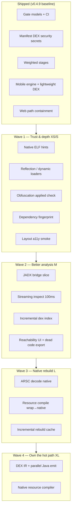

# APEX Innovation Slice-by-Size Build Design

> **Purpose:** A salami roadmap sized by effort (XS → XL) that turns lessons from
> shipping v0.4.x into **native APEX alternatives** — not perpetual wrappers of
> jadx / apktool / MobSF — while keeping the hard-gate discipline we proved works.

This doc is the brainstorm + build design. Each slice has: **size**, **innovation
angle** (why we build our own), **exit test**, and **gate hook** (how CI proves it).

---

## 1. Innovation thesis (what we learned)

| Lesson | From shipping | Design response |
|--------|----------------|-----------------|
| **Two Python worlds** | Desktop pytest ≠ Chaquopy runtime | Every slice that touches mobile ships **structural smoke + on-device parser validation** (`engine_validate`, `audit_mobile_hard_gate.sh`) |
| **Plans lie without grep** | Audit doc assumed stubs; code already had xref + reachability | Each slice starts with **repo truth table** (`docs/SLICE_TRUTH.md` one-liner per capability) before writing specs |
| **Network surface = product** | `apex mobile` on `0.0.0.0` had arbitrary path read | **Containment slice** is mandatory for any LAN/mobile mode; default-deny workspace |
| **Heavy paths fail on phone** | `create_xref()` OOM on real APK | **Tier-aware engines**: lightweight on-device, full on desktop; never one code path |
| **Gate without weights is theater** | New scanners didn’t affect score until wired | **Slice ships = scanner + weight + test fixture + `apex gate --ci`** |
| **Competitor gap is integration + trust** | Users glue jadx + apktool + scripts | APEX wins on **one workflow + verify + gate + mobile offline** — not “another decompiler” |
| **Self-sufficiency principle** | PRINCIPLES.md | Wrap **only** as **XS bootstrap**; every wrap slice names its **native replacement slice** |

**North star:** *APEX is the tool that inspects, explains, rebuilds, and gates Android packages locally — on PC or on the phone — with evidence, not vibes.*

---

## 2. Size definitions

| Size | Effort (1 engineer) | Typical deliverable |
|------|---------------------|---------------------|
| **XS** | 0.5–2 days | Single module, tests, gate weight or CI hook |
| **S** | 3–7 days | Scanner + UI + gate + fixture |
| **M** | 2–4 weeks | Parser or pipeline vertical (decode path segment) |
| **L** | 1–2 months | Replace a major external dependency |
| **XL** | Quarter+ | IR/decompiler or full resource compiler |

**Rule:** No **L/XL** slice starts until its **XS security/gate** prerequisite is green.

---

## 3. Architecture layers (where slices land)

```text
                    ┌─────────────────────────────────────┐
                    │  Surfaces: CLI · Web · Mobile · MCP │
                    └──────────────────┬──────────────────┘
                                       │
         ┌─────────────────────────────┼─────────────────────────────┐
         │                             │                             │
         ▼                             ▼                             ▼
   apex/gate/                    apex/workflows/                 apex/web + security
   (scorecard)                   (analyze pipeline)              (API containment)
         │                             │                             │
         └─────────────────────────────┼─────────────────────────────┘
                                       ▼
              ┌────────────────────────────────────────────┐
              │  apex/analysis · secrets_scan · reachability │
              └────────────────────────┬───────────────────┘
                                       ▼
         ┌─────────────────────────────┴─────────────────────────────┐
         │                     Rust core (performance + safety)       │
         │  zip_reader · dex_parser · dex_reader · [arsc] · [manifest]│
         └────────────────────────────────────────────────────────────┘
```

---

## 4. Wave map (dependency order)



---

## 5. Slice catalog by size

### Legend

- **Status:** ✅ done · 🟡 partial · ⬜ planned  
- **Innovation:** what we build instead of buying/wrapping forever  
- **Exit:** concrete pass condition  
- **Gate:** scanner name + suggested weight (total must stay 1.0)

---

### XS slices (quick wins, high leverage)

| ID | Slice | Status | Innovation | Exit | Gate |
|----|-------|--------|------------|------|------|
| XS-0 | Web workspace containment | ✅ | Own security model for LAN/mobile API | POST `/api/open` with `/etc/passwd` → 400 | `api` (policy, not APK) |
| XS-1 | Secret pattern scanner | ✅ | Built-in detect-secrets class rules | Fixture APK with fake API key → finding | `secrets` 0.15 |
| XS-2 | Extension-agnostic ZIP resolve | ✅ | Picker-proof container open | Extensionless release ZIP resolves nested APK | part of `dex` |
| XS-3 | On-device lightweight DEX | ✅ | Tier engine ≠ desktop engine | 4398 classes on APEX-Mobile APK on phone | `dex` tier tests |
| XS-4 | Boot parser smoke (`engine_validate`) | ✅ | Fail at engine start, not first upload | Chaquopy boot reads `smoke_manifest.bin` | CI import smoke |
| XS-5 | **Obfuscation-applied flag** | ⬜ | Flag release APK with readable names + no mapping | Release build without mapping → WARN | `obfuscation` 0.05 |
| XS-6 | **DexClassLoader / reflection strings** | 🟡 | DEX string watchlist in gate | Known loader strings in DEX → WARN | `dex_watch` 0.02 |
| XS-7 | **Gate weight registry** | ✅ | `apex/gate/weights.toml` | Weights sum to 1.0 | meta test |
| XS-8 | **CVE rules pack version** | ⬜ | Curated YAML rules we own (not OSV network) | Rule hits synthetic vuln manifest | `rules` 0.05 |

---

### S slices (1 week verticals)

| ID | Slice | Status | Innovation | Exit | Gate |
|----|-------|--------|------------|------|------|
| S-1 | **Native ELF inspector** | 🟡 | Open `.so` — PIE, GNU_STACK, 16K align | `native_scan` in gate + security_scan | `native` 0.10 |
| S-2 | **Dependency fingerprint** | ⬜ | Hash `lib/**` + Gradle clues → library ID table | okhttp in libs → reported version band | `deps` 0.10 |
| S-3 | **Layout / a11y static** | ⬜ | Decode `res/layout` via existing XML path | Missing `contentDescription` on clickable | `a11y` 0.05 |
| S-4 | **Reachability report export** | 🟡 | Dead code from *our* graph, not MobSF | HTML section + `apex report --reachability` | `reachability` 0.05 |
| S-5 | **MobSF adapter (optional)** | ⬜ | Export gate.json → MobSF ingest, not dependency | `--mobsf-url` optional sidecar | N/A external |
| S-6 | **JADX headless bridge** | ⬜ | XS wrap: `apex decompile --backend jadx` for quality | Same APK: class count ≥ Androguard path | decompile backend |
| S-7 | **ProGuard mapping gate** | 🟡 | Mapping parse exists; gate: mapping present for release | Play release without mapping → WARN | `mapping` 0.05 |

---

### M slices (2–4 weeks)

| ID | Slice | Status | Innovation | Exit | Gate |
|----|-------|--------|------------|------|------|
| M-1 | **Streaming inspect &lt;100ms** | 🟡 | Rust zip + arsc header only — no full zip read | Benchmark: 12MB APK metadata &lt;100ms | perf CI |
| M-2 | **Native dex index at scale** | 🟡 | `apex_dex_reader` default on desktop; fallback explicit | 10k classes indexed without xref OOM | `dex` score uses native |
| M-3 | **Parallel decompile pool** | ⬜ | Process pool per-class; lazy UI fetch | 12MB APK decompile &lt;10s desktop | perf CI |
| M-4 | **Semantic APK diff v2** | 🟡 | Manifest + dex + resource semantic diff | NewPipe vs old: permission delta report | `diff` CLI |
| M-5 | **AAB/XAPK native path** | 🟡 | No bundletool for *analyze* | Play bundle inspect without Java bundletool | `container` |
| M-6 | **Code Pilot tool router** | 🟡 | Agent calls real apex tools with containment | Pilot runs `security-scan` on uploaded APK only | agent tests |

---

### L slices (1–2 months)

| ID | Slice | Status | Innovation | Exit | Gate |
|----|-------|--------|------------|------|------|
| L-1 | **ARSC decode native** | ⬜ | Replace aapt2 for *read* path | Decode resources.arsc → XML without aapt2 | decode backend `native` |
| L-2 | **Incremental rebuild** | ⬜ | Content-hash cache per entry | Second build &lt;20% first build time | roundtrip CI |
| L-3 | **Framework auto-fetch** | ⬜ | Own framework-check + download UX | NewPipe decodes without manual `apktool if` | `framework` |
| L-4 | **Unified gate + mobile audit** | 🟡 | One `hard_gate.sh` = desktop + mobile + release | Single command PASS before tag | release policy |

---

### XL slices (strategic — own the core)

| ID | Slice | Status | Innovation | Exit | Gate |
|----|-------|--------|------------|------|------|
| XL-1 | **DEX IR + Java emitter** | ⬜ | Own decompiler; JADX bridge only as fallback | IR tests on corpus.dex fixtures | decompile quality suite |
| XL-2 | **Native resource compiler** | ⬜ | Replace aapt2 for *write* path | Edit layout XML → rebuild → install | roundtrip fidelity |
| XL-3 | **On-device Rust dex_reader** | ⬜ | Chaquopy wheel for arm64 dex_reader | Phone indexes 5MB dex without Androguard | mobile perf |
| XL-4 | **APEX Mobile QA lab** | ⬜ | Firebase Test Lab *for our app only* | Instrumented Choose APK test | mobile-hard-gate |

---

## 6. Gate scorecard evolution (target weights)

Current (v0.4.9):

```text
manifest 0.30 | dex 0.20 | security 0.35 | secrets 0.15
```

**Wave 1 target** (after XS-5…XS-8, S-1…S-3):

```text
manifest   0.22
dex        0.18
security   0.22
secrets    0.12
native     0.10
deps       0.08
obfuscation 0.05
a11y       0.05
rules      0.05
reachability 0.03   # informational; optional FAIL at production stage
```

**Policy:** `production` stage requires **100.0** score and **zero FAIL**; new WARN-only scanners don’t block `candidate`.

---

## 7. “Better alternative” scorecard vs competitors

| Capability | jadx | apktool | MobSF | APEX today | APEX after Wave 1–2 |
|------------|------|---------|-------|------------|---------------------|
| Local / no cloud | ✅ | ✅ | optional | ✅ | ✅ |
| On-phone engine | ❌ | ❌ | ❌ | ✅ | ✅ + Rust index |
| Unified inspect→rebuild | ❌ | partial | partial | ✅ | ✅ faster inspect |
| Security pre-decode | ❌ | CVE only | ✅ | 🟡 | ✅ + secrets + native |
| Roundtrip verify | ❌ | ❌ | partial | ✅ | ✅ incremental |
| Gate / CI promotion | ❌ | ❌ | partial | ✅ | ✅ richer weights |
| Best Java decompile | ✅ | ❌ | uses tools | 🟡 | 🟡 JADX bridge → XL |
| Dynamic analysis | ❌ | ❌ | ✅ | ❌ | ❌ (by design) |

**Positioning:** APEX is not “better jadx.” It is **the integrated local gate + mobile analyst** that *optionally* delegates decompile quality to jadx until XL-1 ships.

---

## 8. Recommended build sequence (next 90 days)

```text
Week 1–2   XS-5, XS-6, XS-7, S-1          # obfuscation, reflection, weights, ELF
Week 3–4   S-2, S-3, XS-8                  # deps fingerprint, a11y, rules pack
Week 5–8   S-6, M-2, M-1                    # JADX bridge, native dex default, fast inspect
Week 9–12  S-4, M-4, L-4 polish             # reachability export, diff v2, unified gate
```

Parallel track (mobile): XL-3 spike — **can we ship `apex_dex_reader` on Chaquopy?** If no, keep lightweight Androguard path.

---

## 9. Per-slice salami cycle (unchanged, enforced)

```bash
# Every slice, no exceptions
scripts/validate_slice.sh
pytest tests/ -q
apex gate tests/fixtures/sample_test.apk --ci
# mobile slice also:
scripts/check_github_ci.sh --apk
bash scripts/audit_mobile_hard_gate.sh vX.Y.Z
```

**Slice is not done** until:

1. Exit test in table above passes  
2. Gate weight updated (if applicable)  
3. `PROJECT_STATE.md` one-line status  
4. No new arbitrary-path or unbounded-network surfaces  

---

## 10. What we explicitly do NOT slice (non-goals)

- Malware sandbox / emulator (MobSF dynamic)  
- Play Store competitor / mod marketplace  
- Cloud-hosted analysis SaaS (conflicts with local-first)  
- “AI malware verdict” without human-readable evidence  

---

## 11. One-page summary

**Innovation = own the workflow, own the gate, own the mobile runtime, natively replace parsers incrementally.**

| Size | Count planned | Theme |
|------|---------------|--------|
| XS | 8 (4 done) | Trust, wiring, flags |
| S | 7 (2 partial) | Scanners that beat scripts |
| M | 6 (4 partial) | Performance + bridges |
| L | 4 (1 partial) | apktool/aapt2 replacement |
| XL | 4 (0 done) | Decompiler + mobile Rust |

Start the next sprint at **XS-7 (weight registry) + S-1 (ELF)** — smallest diff that makes every future scanner cheaper and proves “we inspect natives ourselves.”
