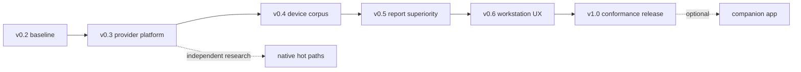
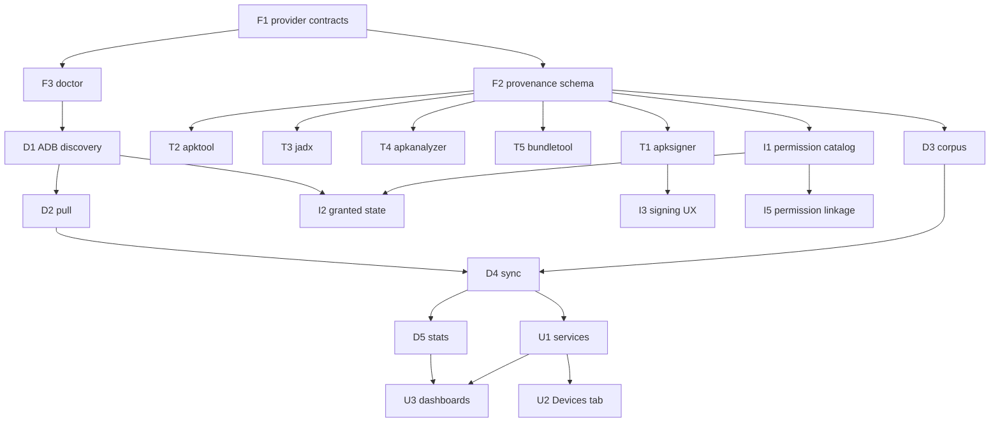

# APEX implementation roadmap

Date: 2026-08-02  
Status: ordered engineering plan  
Architecture contract: [`IMPLEMENTATION_GUIDE.md`](IMPLEMENTATION_GUIDE.md)  
Product direction: [`COMPETITIVE_STRATEGY.md`](COMPETITIVE_STRATEGY.md)

---

## 1. Roadmap rules

This roadmap is dependency-ordered, not calendar-based.

- Complete the acceptance gate for a slice before marking it done.
- A release may contain multiple independently completed slices.
- Optional-tool absence may skip conformance tests, but cannot be reported as
  a successful conformance result.
- Keep current v0.2 workflows usable throughout migration.
- Native parser/decompiler research does not block provider or device work.
- “Industry standard” means repeatable correctness, evidence and interoperability;
  it does not mean reimplementing every upstream tool.

### Slice identifiers

The original blueprint and competitive strategy both used `1.x` identifiers
for different work. This roadmap uses unique prefixes:

| Prefix | Workstream |
|---|---|
| `F` | provider foundation |
| `T` | specialist tool adapters |
| `D` | device and corpus |
| `I` | report intelligence |
| `U` | UX, automation and distribution |
| `C` | optional companion app |
| `R` | native research |

---

## 2. Release sequence

| Target | Outcome |
|---|---|
| v0.3 | provider abstraction, provenance, official-tool adapters and truthful doctor |
| v0.4 | ADB device list/pull/sync with incremental SQLite corpus |
| v0.5 | permission, certificate, component and export report completeness |
| v0.6 | Devices UI, corpus dashboards/diff, stable automation surfaces |
| v1.0 | measured conformance, packaging, security/privacy and migration gates |

Version labels describe intended grouping. Acceptance gates, not version
numbers, determine readiness.

---

## 3. v0.3 — provider platform

### F1 — Provider contracts and bounded runner

Deliver:

- `apex/providers/types.py`
- `apex/providers/runner.py`
- `apex/providers/registry.py`
- typed capability names, `ProviderResult`, `ProvenanceRecord`
- executable/JAR resolution and bounded subprocess execution

Migrate:

- `workflows._command_path`
- `workflows._run`
- `workflows._apktool_command`

Acceptance:

- selection tests cover `auto`, explicit provider, missing provider and timeout
- subprocess runner never invokes a shell
- stdout/stderr and time are bounded
- secret-bearing arguments are redacted
- existing Python tests remain green

### F2 — Report schema v3 and provenance

Deliver:

- provenance in analyze, decompile, decode/build, verify and relevant security
  outputs
- schema v2 reader compatibility
- HTML “Produced by” summary
- one canonical APEX version source

Acceptance:

- every derived section has an operation/provider record
- Rust-to-Python ZIP fallback is visible
- old schema v2 fixture remains readable
- old top-level report fields remain available
- reports contain no signing secrets

Dependency: `F1`.

### F3 — Doctor v2

Deliver:

- normalized status/version/path/source/install hint for Java, jadx, apktool,
  apksigner, apkanalyzer, bundletool, adb, aapt2, Androguard and Rust ZIP
- capability readiness/degraded/unavailable map
- stable JSON schema

Acceptance:

- missing tools have an actionable hint
- core `ready=true` requires core analysis, not every optional tool
- malformed version output does not crash doctor
- provider registry and doctor report the same selection

Dependency: `F1`.

### F4 — Dependency and documentation cleanup

Deliver:

- remove unused `networkx`
- document external tool environment variables
- make the roadmap identifiers authoritative for new work
- add schema/version migration notes

Acceptance:

- package installs and imports without `networkx`
- dependency audit shows no APEX-declared package without an import or stated
  runtime purpose

Dependency: may land with `F1`.

### T1 — apksigner verification oracle

Deliver:

- signature verification provider
- tolerant normalized parser
- bounded raw diagnostic evidence
- Androguard fallback

Acceptance:

- valid and invalid signed APK fixtures are distinguished
- SHA-256 signer fingerprint is normalized
- scheme results match apksigner on the signed mobile fixture
- unavailable apksigner produces a labeled fallback, not “officially verified”
- v4 is not claimed without `.idsig` context

Dependency: `F1`, `F2`.

### T2 — apktool 3.x provider

Deliver:

- provider-owned decode/build/version probe
- 3.x/aapt2 compatibility diagnostics
- provenance in `apex-project.json` and build output

Acceptance:

- zero-edit apktool decode/build succeeds on a real APK when tool is installed
- unsupported versions fail with an actionable compatibility message
- raw backend remains payload-identical on its existing test
- edited compiled resources are never silently routed through raw build

Dependency: `F1`, `F2`.

### T3 — jadx preferred decompiler

Deliver:

- full-tree CLI provider
- single-class lazy provider
- timeout/process isolation
- normalized existing decompile index
- Androguard DAD fallback

Acceptance:

- `auto` prefers jadx when available
- real fixture resolves seven classes
- `MainActivity` and `onCreate` appear in Java output
- explicit `--provider jadx` fails if missing; it does not silently fall back
- automatic fallback is recorded when jadx fails
- output paths remain contained in the requested directory

Dependency: `F1`, `F2`, `F3`.

### T4 — `apkanalyzer` conformance adapter

Deliver:

- adapters for APK summary/files, manifest permissions, DEX reference counts,
  resources and compare as applicable
- semantic difference report
- optional corpus runner

Acceptance:

- benchmark results never override APEX product output
- absence is `skipped/unavailable`, not pass
- known fixture differences have actionable field paths
- signing verification does not use this adapter

Dependency: `F1`, `F2`.

### T5 — bundletool AAB/APKS provider

Deliver:

- bundle inspect/build-apks/extract workflow
- optional device-spec support
- route generated APKs through normal APEX analysis

Acceptance:

- generated `.apks` is inventoried and extracted safely
- base and split APKs retain identity in results
- insufficient signing/device input is reported explicitly
- shallow built-in AAB inspection remains labeled as shallow

Dependency: `F1`, `F2`, `F3`.

### T6 — Cheap decompile preflight

Deliver:

- evidence-based packer/protector and unusual DEX-shape hints
- cost estimate/decision before full Java export
- user override

Acceptance:

- findings contain evidence and confidence, not a malware verdict
- preflight never blocks explicit decompile without user-controllable override
- known synthetic shape avoids unintended expensive auto-decompile

Dependency: `T3` is not blocked by this slice; integrate after the jadx path is
working.

### v0.3 release gate

- `F1–F3`, `T1–T3` complete
- `T4` and `T5` may be feature-gated but their doctor states are present
- all default tests pass
- available specialist-tool conformance tests pass
- no report provenance gaps in core workflows
- README installation and fallback behavior match reality

---

## 4. v0.4 — device and corpus

### D1 — ADB discovery and typed device states

Deliver:

- `apex/device/adb.py` and models
- `apex device list`
- explicit serial selection
- connected/offline/unauthorized states

Acceptance:

- recorded `adb devices -l` fixtures parse deterministically
- multiple devices require `--serial`
- no device is a clean empty/unavailable state
- shell arguments are not interpolated

Dependency: `F1`, `F3`.

### D2 — Package enumeration and split-aware pull

Deliver:

- package list for selected Android user
- base/split path discovery
- deterministic, contained local layout
- atomic pull metadata

Acceptance:

- base and split APKs are classified correctly
- package, remote path and local filename validation reject traversal
- interrupted pull does not publish a completed package directory
- pulled artifact hashes and provenance are recorded

Dependency: `D1`.

### D3 — Corpus schema and migrations

Deliver:

- dedicated `CorpusStore`
- `devices`, `sync_runs`, `package_snapshots`, `artifacts`,
  `snapshot_artifacts`, and `analyses`
- WAL, foreign keys and transactional migration system

Acceptance:

- fresh create and migration tests pass
- failed transaction leaves the last successful snapshot queryable
- repeated artifact hashes deduplicate storage
- corpus DB is not coupled to report-section key/value storage

Dependency: can begin after `F2`; integrates after `D2`.

### D4 — Incremental `device sync`

Deliver:

- quick fingerprint and strict-content modes
- changed-only pull
- artifact deduplication
- analyze-once per content hash and report schema

Acceptance:

- second unchanged sync performs no APK pull
- same version with changed content creates a new artifact
- failed sync is recorded but not selected as latest successful state
- work-profile/user selection remains explicit
- core device workflow makes no cloud request

Dependency: `D2`, `D3`.

### D5 — Corpus statistics and history

Deliver:

- `apex device stats`
- package/SDK/permission/signing/native ABI/DEX summaries
- sync history and changed/added/removed packages

Acceptance:

- stats read the index without reanalyzing APKs
- corpus-only target is under 500 ms on a committed representative fixture
- result includes data scope (device, user, successful sync ID)

Dependency: `D4`.

### D6 — Optional live-device integration suite

Deliver:

- explicit pytest marker
- safe read-only list/pull/sync procedure
- cleanup-free local artifact directory

Acceptance:

- skipped with reason when no authorized device exists
- never installs, launches, uninstalls or modifies a package
- selected serial and user are shown before execution

Dependency: `D4`.

### v0.4 release gate

- `D1–D5` complete
- no partial sync can replace a successful snapshot
- deterministic tests do not require a phone
- optional live suite passes on at least one supported Android version
- ADB privacy/security behavior is documented

---

## 5. v0.5 — report completeness and superiority

### I1 — Versioned AOSP permission catalog

Deliver:

- reproducible generator and committed catalog
- source revision/license metadata
- label, description, protection level and flags

Acceptance:

- every fixture permission is enriched or explicitly `unknown`
- custom/OEM permission remains visible
- static reports use `granted=null`
- generation is deterministic

Dependency: `F2`; can run in parallel with device work.

### I2 — Device granted-state enrichment

Deliver:

- version-tolerant package-state parser
- declared/granted distinction
- grant source and unavailable reason

Acceptance:

- recorded output from multiple Android versions parses
- field-level parser failures do not erase declared permissions
- device/user context is included

Dependency: `D1`, `I1`.

### I3 — Signing report and warnings

Deliver:

- certificate/scheme panel data
- fingerprints, established validity and lineage fields
- semantic warnings

Acceptance:

- UI/report matches normalized apksigner result
- cryptographically valid is not presented as trusted publisher
- unavailable fields have reasons
- Androguard fallback is visually distinct

Dependency: `T1`.

### I4 — Components, features and intent filters

Deliver:

- complete activity/service/receiver/provider presentation
- exported/enabled/permission state
- intent filters, deep links and device features
- device launch action only after safety checks

Acceptance:

- Android 12 exported behavior is represented
- component aliases and relative names resolve correctly
- no component launch occurs without explicit user action

Dependency: `F2`; launch action also depends on `D1`.

### I5 — Permission-to-code evidence

Deliver:

- versioned permission-to-API mapping
- DEX reference evidence
- class/method navigation

Acceptance:

- report distinguishes declared, referenced and runtime-proven states
- every linkage includes class, method and API evidence
- no API reference is described as executed behavior

Dependency: `I1`, existing DEX cross-references; enhanced UX benefits from `T3`.

### I6 — Icon and report/export parity

Deliver:

- icon extraction including adaptive icon layers where supported
- export bundle containing selected APK/splits, report, manifest and optional
  decompiled source
- checksummed export manifest

Acceptance:

- output is deterministic apart from documented timestamps
- unavailable icon/resource states are explicit
- export never escapes destination or includes secrets

Dependency: `F2`; split export benefits from `D2`.

### v0.5 release gate

- `I1`, `I3`, `I4`, `I6` complete
- device-only fields degrade cleanly without ADB
- report completeness matrix against Martin Styk APK Analyzer is updated
- official-tool semantic differences are understood or documented

---

## 6. v0.6 — workstation UX and automation

### U1 — Application-service boundary

Deliver:

- shared analysis/decompile/device/corpus services
- CLI and web handlers use the same services
- background job model for long operations

Acceptance:

- no duplicate provider logic in HTTP handlers
- job status has stable JSON and bounded errors
- existing `/api/open` behavior remains compatible

Dependency: `F2`, `D4`.

### U2 — Devices tab

Deliver:

- connected device states
- corpus package browser
- sync control and progress
- one-click package-to-analysis flow

Acceptance:

- no broad inventory claim when device access is unavailable
- selected device/user/snapshot is always visible
- UI uses corpus API rather than scanning files itself

Dependency: `U1`, `D4`.

### U3 — Corpus dashboards and history diff

Deliver:

- SDK/permission/signing/native/DEX distributions
- added/removed/changed package history
- drill-down to evidence

Acceptance:

- dashboard figures reconcile with `apex device stats`
- every chart states scope and snapshot
- large corpora use indexed queries

Dependency: `U1`, `D5`.

### U4 — Stable automation surfaces

Deliver:

- documented JSON schemas
- consistent `--output` across commands
- stable exit-code table
- SARIF for evidence-backed security findings

Acceptance:

- schema fixtures are versioned
- CLI stdout remains machine-readable where promised
- SARIF rules map to evidence and do not overclaim malware

Dependency: `F2`, security finding normalization.

### U5 — Packaging and explicit tool bootstrap

Deliver:

- reproducible Python/Rust packages
- platform installation docs
- optional explicit tool installer with checksums/licenses, if adopted
- first-run doctor guidance

Acceptance:

- core installation works without Android SDK tools
- managed tools never download implicitly
- Linux/macOS/Windows packaging matrix is recorded
- offline inspect/analyze remains functional after install

Dependency: stable provider paths from v0.3.

### U6 — Performance and resilience corpus

Deliver:

- redistributable small/medium/large fixture manifest
- cold/warm benchmarks
- malformed/packed/large APK failure corpus
- regression thresholds

Acceptance:

- benchmark reports include fixture hash, hardware, provider versions, median
  and p95
- inspect remains under the documented local target
- worker timeout/OOM does not terminate the main process
- no unverified “10x” claim appears in release material

Dependency: provider and device paths stable.

### v0.6 release gate

- `U1–U4` complete
- GUI walkthrough covers device package to full report
- CLI/API schema documentation is published
- packaging candidate passes default and available conformance suites

---

## 7. v1.0 — conformance and trust gate

v1.0 requires all of the following:

### Correctness

- report schema compatibility policy is published
- jadx preferred/fallback quality measured on the committed corpus
- apksigner normalized results match official output
- apktool zero-edit rebuild behavior is documented and tested
- AAB/APKS workflows are explicit about universal vs device-targeted output

### Product completeness

- metadata, permissions, components, signing, icons and export meet the parity
  matrix or show explicit unsupported reasons
- DEX/Java, rebuild, verify, diff, security and device corpus remain the
  superiority layer
- device workflow is useful without a companion app

### Security and privacy

- archive, provider-output, pull and export containment reviewed
- no secrets in logs/provenance/reports
- no telemetry by default
- no core-analysis network dependency
- static findings remain evidence-first

### Reliability

- all default Python/Rust tests pass
- optional-tool conformance suite passes for the supported release matrix
- optional live-device suite passes on the declared Android versions
- migration tests cover report and corpus schemas
- interrupted provider/sync operations recover safely

### Distribution

- install/doctor/fallback documentation matches packaged behavior
- third-party tools and data have source/license/checksum records
- release artifacts have reproducible version metadata

---

## 8. Optional post-v1.0 companion

The companion is not on the workstation critical path.

### C1 — Policy decision and distribution plan

- decide Play, F-Droid/GitHub, enterprise, or multiple variants
- document package-visibility justification for each
- use the narrowest feasible `<queries>` declarations

### C2 — Minimal Kotlin client

- allowed app inventory
- explicit APK selection/export where platform permits
- no heavy decompilation engine
- local-only pairing

### C3 — Desktop pairing protocol

- authenticated, encrypted local channel
- explicit device approval
- revocable pairing
- no cloud relay requirement

### C4 — Companion conformance

- Android API/version matrix
- work profile and secondary-user behavior
- package-visibility and privacy review

No companion release may describe itself as an all-seeing installed-app scanner
unless its actual distribution policy and Android permissions support that
claim.

---

## 9. Native research track

Run independently and promote only after evidence.

| Slice | Research outcome | Promotion gate |
|---|---|---|
| `R1` | batch/columnar Rust ZIP inventory FFI | faster than Python on representative corpus without schema loss |
| `R2` | PyO3 Rust DEX structural index | semantic parity with Androguard on corpus and lower measured cost |
| `R3` | native AXML/ARSC hot path | parity on malformed/OEM/resource corpus |
| `R4` | native signing-block reader | conformance with apksigner across schemes/lineage corpus |
| `R5` | native Java emitter experiments | measurable quality or latency advantage over jadx/Androguard |

Failure to meet a promotion gate leaves the provider implementation in place.
Research results are still valuable as validators and security hardening.

---

## 10. Dependency map

After `F1–F3`, the following can proceed in parallel:

- `T1–T5`
- `D1`
- `I1`
- packaging preparation

Keep one schema owner for `F2` while these branches integrate.

---

## 11. Immediate next work

Start with this exact sequence:

1. `F1` provider types/runner/registry
2. `F2` report schema v3/provenance
3. `F3` doctor v2
4. `F4` dependency/version cleanup
5. `T1` apksigner verification
6. `T3` jadx preferred decompile
7. `T2` apktool 3.x hardening

Once `F1–F3` are stable, `D1` and `I1` can begin without waiting for every
specialist adapter.
